# Encapsulation

>Architecture is basically a container of something. I hope they will enjoy not so much the teacup, but the tea.  
_Yoshio Taniguchi_

\vspace{10mm}

[[**ACCESS UNIT 2 LECTURE MATERIALS**](https://drive.google.com/drive/folders/1q2pIB3D0Cv_jvKy42kNS64zF40rvvbaP?usp=sharing)]

\vspace{6mm}

## 7: The Lipid World and Protocells {-}

For the next few units, we will explore the various hypotheses of how living organisms emerged from non-living entities: how the chemistry of early Earth became the biochemistry of life. The idea that living organisms could originate from non-living entities is not new; Aristotle wrote about spontaneous generation in the 4th century BCE. But Alexander Oparin and JBS Haldane formalized this idea in modern terms in a hypothesis known as the **Heterotrophic hypothesis**, based on the following points:

1. The atmosphere of early Earth was low in oxygen, meaning oxygen could not steal electrons from other compounds. (We'll learn more about this later, but it's important for \~cHemIsTry\~ reasons!)
2. When the atmosphere of early Earth was exposed to energy (like lightning), simple organic compounds were likely produced (remember monomers?).
3. These compounds (monomers!) collected in what we now call a **prebiotic soup** that may have concentrated in places like oceanic vents.
4. More complex polymers and life could have potentially developed as the monomers in the soup were transformed through chemical reactions.

We know from the previous unit that all organisms are essentially composed of the same stuff, and we know that experiments have recovered some of this "stuff" by simulating the conditions of early Earth. This demonstrates that there is a possible path from chemistry to biochemistry. But, while there are many hypotheses, we don't know precisely how this transition occurred or in what order. This is an area of active research with passionate debates among scientists. 

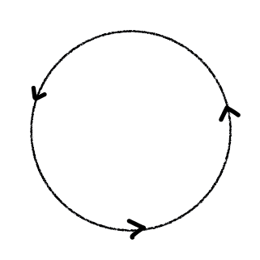{width="35%"}

I once heard the emergence of life described as "closing a loop." Before the loop is closed, there are two clear ends. But once the loop closes it becomes impossible to tell where it began. After the next three units, we all may have different opinions on the emergence of biological life. In fact, I hope we do! That's the fun stuff.

So we begin first with lipids. We learned in the previous unit that there is a kind of lipid molecule called a "phospholipid." These molecules are special because they are constructed of a polar head and a nonpolar tail. We call this kind of molecule **amphiphilic**, which means that it has both polar and nonpolar parts. This feature becomes really important when we consider that life originated in early oceans, otherwise known as water. (When a "solution" is water-based, we say that it is **aqueous**.)

.)](images/phospholipid.png){width="90%"}

### Why membranes matter {-}

First of all, what do I mean when I talk about a "membrane" in the first place? Put simply, a membrane is a barrier between two things. These are typically selective, meaning that some things are able to pass while other things aren't able to pass. (The [Gandolf](https://www.youtube.com/watch?v=3xYXUeSmb-Y) of biological entities. Nah, just playing.) Anyway, we'll focus on **biological membranes**, which are the the objects that separate a cell from the outside world. Now, this alone is pretty essential. How could we be living organisms if we couldn't organize ourselves separately from our external environment? I mean, really, what would that even look like? How can you drink a glass of water without the cup?

.)](images/barrier.jpeg){width="85%"}

So the most obvious job that cell membranes have is they provide a compartment for the business of life to occur without the external environment interfering too much. These barriers allow some things to enter the cell---important things, like molecules for energy or building blocks for proteins---and some things to leave the cell as waste. We refer to this as **selective permeability**: not everything can enter or exit. We will learn more about this feature in the next lecture. Not only that, but there are also cellular components with special functions found _inside_ many cells, and these too are enclosed in membranes of their own! This allows different chemical reactions to occur in tandem without disrupting one another.

{width="40%"}

The other reason membranes matter is that they allow for the creation of **gradients**. The clearest example of a gradient that we all know is a color gradient. But, there are also other kinds of gradients. In chemistry, we can have a **concentration gradient**, in which the concentration of something is higher in one area than in another area. The presence of membranes allows for a special type of gradient called an **electrochemical gradient**, which occurs when there is a difference in charged particles on either side of a barrier. Remember ions? Ions are charged atoms that have more electrons than they do protons, or protons than they do electrons. If we have more ions on one side of a membrane than on the other---we can actually store energy that way!

.)](images/electrochemical.png){width="60%"}

### The first two laws of thermodynamics {-}

The first two laws of thermodynamics are as follows:

**Energy cannot be created or destroyed.** All the energy that does all the work _in the entire universe_ began just over 13 billion years ago with the Big Bang. This energy can be transformed into different kinds of energy, but we cannot create energy from scratch or destroy existing energy.

**Entropy in the universe is constantly increasing.** When energy is used to perform work, some amount of it is lost as heat. There is an unstoppable trend toward randomization of the universe as a whole, and disorder, or **entropy**, increases as energy is transferred or transformed. Basically, stuff decays with the passage of time unless energy is used to actively prevent this. (Some stuff is also irreversible, like you cannot unbreak an egg.)

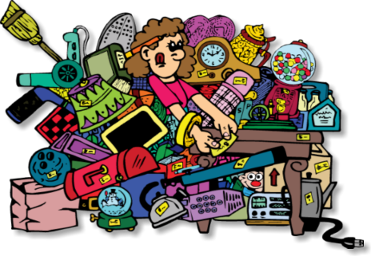{width="45%"}

The analogy I'm about to tell you is not exactly right, but think of the second law of thermodynamics like keeping your house clean. It requires energy to actively maintain a house in a clean state. (Actually, it requires energy to actively maintain a house, full stop.) If one day you no longer pick up after yourself or do the dishes, the house gets messy pretty quickly.

Now that we're thinking about my (bad) analogy, living organisms are kind of like this too. It requires _a lot_ of energy to actively maintain our organization. We must exist far outside equilibrium with our surrounding environment, and it costs energy to keep that up. All of us animals have to eat food, and if we don't eat food, we die. What are we getting from food? In large part, the chemical energy we need to maintain our ordered structure in a universe that tends toward entropy. As we take in chemical energy, produce waste, and give off heat, the entropy _of the universe_ is increasing. But while we are alive we exist as ordered and complex structures. One of the main features of our construction that allows for this is our biological membranes.

### The broad arguments for the Lipid World {-}

Okay, so what about lipids lends themselves to the origins of biological life? The first thing is that almost any time you drop phospholipids into water, you get the formation of simple membranes. These membranes take on various shapes. The lipids do not require anything to assemble into these shapes, they just do. The spontaneous formation of **micelles** and **lipid bilayers** seems like a wonderful starting point for life. Why? Because phospholipids do this naturally, and in the primordial soup of early Earth, these structures could have formed, encapsulating other molecules. Molecules have a tendency to spread out over available space, but the aggregation of lipids may have trapped molecules together in close proximity. Small molecules trapped inside lipid membranes could eventually form **protocells**, a hypothetical precursor to what we know today as a cell.

.)](images/micelles.jpeg){width="85%"}

Another feature of lipids is that they are a very diverse group of molecules. Remember that we discussed phospholipids we talked about the phosphate group head and two fatty acid tails. But there are other kinds of lipid molecules with different groups as the polar head instead of phosphate. Moreover, the **hydrocarbon chains** (a carbon backbone bound to hydrogen) that make up the fatty acid tails can have different lengths and different arrangements of double bonds. Thus it is possible to have a large diversity of structures from a variety of different lipid building blocks.

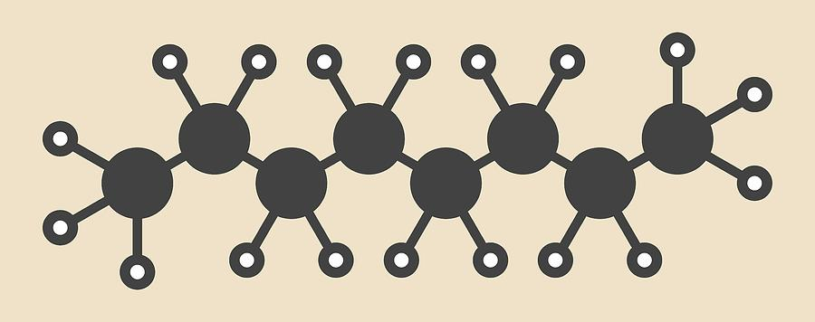{width="50%"}

An important question to ask is how the lipids assembled in the first place. Scientists that study prebiotic Earth have done a variety of synthesis experiments simulating these conditions, and have found the formation of lipid-like amphiphilic molecules including long-chain hydrocarbons. Another possibility is that long-chain hydrocarbons arrived on Earth from a comet or meteor. But what's essential is that lipids are much easier to assemble in prebiotic conditions---that is, without special proteins to aid in the reaction or the normal metabolic processes that occur in life now---than other biological molecules like DNA. This makes them an attractive candidate for the origins of early life.

\newpage

## 8: Cell Membranes and Transport {-}

It seems pretty obvious to us that living organisms are composed of cells. But of course, a mad long time ago, we had no way of knowing this. You really can't see a cell with just your eyeballs. What that means is that humans needed to develop a substantial amount of technology in order to see a cell in the first place. 

{width="50%"}

First, you need to invent glass. While human civilizations have been making glass for at least 3600 years, it wasn't until the 13th century that we start to see glass purified to the extent that it can be used for magnification. Around this time we start to see the first eyeglasses, which are essentially a luxury item that only few can afford. But in 1665, Robert Hooke used a microscope to write his opus _Micrographia_, drawing intricate illustrations of a lot of things, including the edges of razor blades, the eyes of insects, and also, cells. (He called them cells because they looked like the chambers that monks live in.)

Around the same time, Anton van Leeuwenhook invented his own microscope. Hooke's microscope magnified about fifty times. But this new microscope was substantially better, allowing Anton to observe objects at 300x magnification. And boy, did he observe. Pond water (he found bacteria!), spit (he also found bacteria!), and... other bodily fluids. He documented his findings in a series of letters to the Royal Society in London and these letters revolutionized the study of disease.

Now we know that every living organism on this Earth is composed of one or more cells. We say that cells are the basic unit of life. Smaller than a cell (hello, virus!), and we start to have debates. But everyone agrees that once you have a cell you have a living organism. Historically, **cell theory** has three components:

1. All living organisms are composed of one or more cells
2. The cell is the most basic unit of life
3. All cells arise only from pre-existing cells

Of course, one starts to wonder, _Then where did the first cell come from?_ but that's what this class is all about! For the next few lectures, we will focus on what we know for sure about existing cells. And we know for sure that all existing cells come from pre-existing cells.

### Composition of membranes {-}

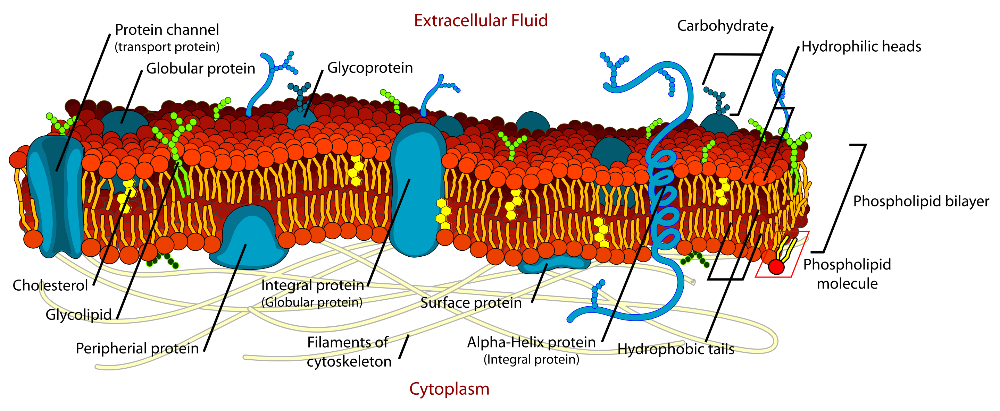{width="90%"}

Membranes are not static. That means that they aren't just a sheet of molecules locked in place. Rather, the lipids and proteins that make up a membrane are largely held together by hydrophobic interactions which are much weaker than covalent bonds. Because of this, lipids and proteins drift around in a sideways motion. This is important for two reasons: (1) membranes need selective permeability, meaning that specific substances need to be let in and out of the cell in a controlled way, and (2) proteins must have the ability to move where they are needed to perform work in the cell. And, because different organisms live in different environments, the membrane itself must be adapted to varying environmental conditions.

**Fluidity**. The fluidity of membranes is affected largely by temperature. As temperature decreases, membranes become tightly packed until the membrane solidifies (think: bacon grease as it cools). How quickly a membrane solidifies and at what temperature depends on the composition of the phospholipids---unsaturated tails cannot pack together as closely as saturated tails. Other molecules in the intermembrane space like cholesterol can affect fluidity.

**Membrane proteins**. Phospholipids form the main structure of the membrane, but it's proteins that do all the work (of course). There are so many proteins in so many different kinds of cellular membranes that we don't even know all the ones that exist and their jobs. The two major kinds of membrane proteins are **integral proteins**, which span the entire membrane, and **peripheral proteins**, which are not embedded within the membrane at all. Proteins are important for passage in and out of the cell, among other things.

**Membrane carbohydrates**. In multicellular organisms, it's important that cells can recognize other cells (cell-cell recognition). Cells recognize other cells by binding to molecules, often containing carbohydrates, on the extracellular surface of the plasma membrane. 

### Permeability, transport, and the fluid mosaic model {-}

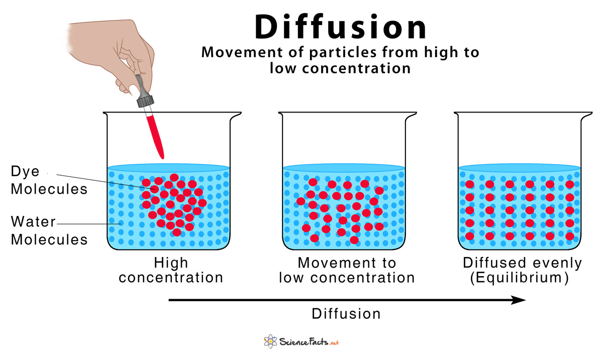{width="70%"}

Let's first unpack the concept of **diffusion**, which is yet another example of an emergent feature. Imagine a clear glass full of water. You put a few droplets of food dye into the water. At first, the food dye is concentrated in certain areas of the water while other areas remain clear. But if you wait a few minutes, eventually the food dye will be distributed evenly throughout the water. What causes that? The behavior of each individual food dye molecule is completely random, but as a _population_ of molecules something interesting occurs. In the absence of any other force, a substance (in this case, food dye) will **diffuse** from an area of high concentration to an area of low concentration---in other words, along a concentration gradient. No energy is needed for this process. This occurs because all atoms tend to "bounce around" randomly in space, but when many of them are tightly packed the atoms hit each other until spacing out evenly ([you can check out an animation here](https://upload.wikimedia.org/wikipedia/commons/4/4d/DiffusionMicroMacro.gif)).

Movement without energy expenditure is called **passive transport**, and diffusion is one example. The diffusion of water across a selectively permeable membrane is called **osmosis**, which is just a specific and special case of regular diffusion. But osmosis is important because the balance of water inside and outside of the cell matters. If we put a cell in a solution that has a high concentration of solutes that are not able to pass through the membrane (called "nonpenetrating solutes") then water will exit the cell in an attempt to create an even concentration of solutes within and without of the cell. This is an example of what happens when you place a cell in a **hypertonic** solution. ("Hyper" means more, and the "more" in this case is nonpenetrating solutes.) If we place a cell in a **hypotonic** solution ("hypo" means less), then water diffuses into the cell through osmosis. An **isotonic** solution has the same concentration of nonpenetrating solutes within and without of the cell.

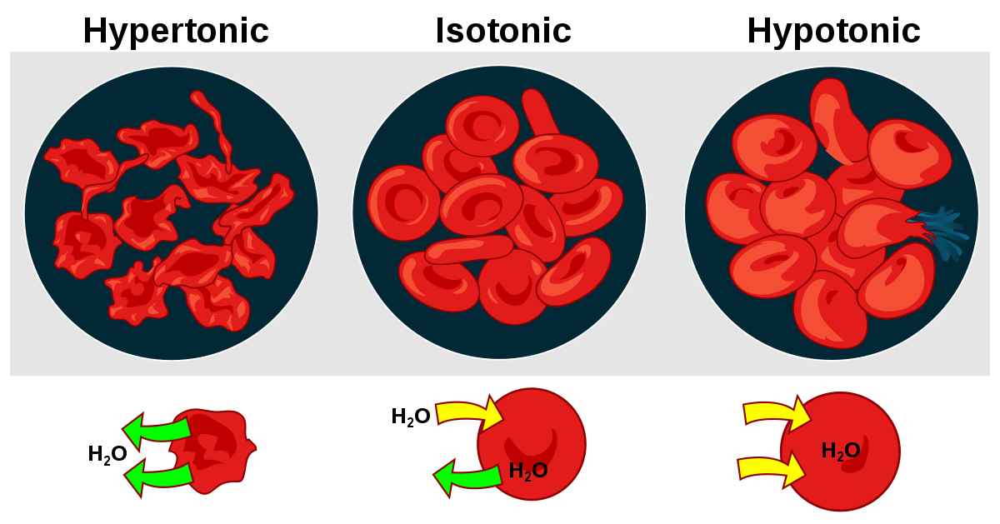{width="65%"}

All cells have voltage---you can think of this as the storage of electrical energy. This comes from the distribution of positive and negative charges (you can also think of this as the distribution of ions) on either side of the membrane. In most cells, the cytoplasm (inside of the cell) is more negatively charged compared to the extracellular side (outside of the cell) because anions (-) and cations (+) are not distributed evenly on either side of the membrane. **Membrane potential** is the difference in charge between the inside and the outside of the cell. Maintaining a certain membrane potential in the cell is important, because certain cells like neurons or muscle cells only function when there is a change in membrane potential. Well, if substances like to spread out over available space, or move from areas of high concentration to low concentration, how do we push substances _against_ their concentration gradient? (Or in this case, against their electrochemical gradient.) We use energy for this kind of movement, and we call it **active transport**.

{width="50%"}

What's crazy is that we discovered cells in the 1600s, but it wasn't until the the early twentieth century that we actually discovered cell membranes. The first roadblock is that scientists wrongly assumed that all cells have cell walls. In fact, all _plant_ cells have cell walls but animal cells do not. Because of this, animal cells are more fragile and easy to tear, so for a long time it was thought only plants actually had cells. In the 1800s, scientists were actively investigating this question and hypothesized that there was a barrier and that it was potentially made from fats. Cells were observed to form spheres in water, similarly to how oil does.

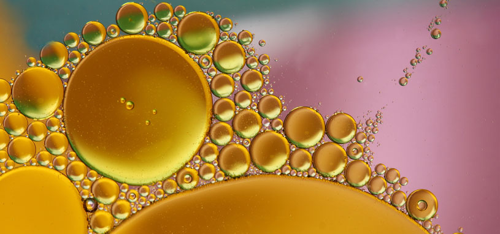{width="50%"}

Another piece of the puzzle came from anesthetics, where it was known that chemicals that were both water soluble and fat soluble could be used for general anesthesia. But the main problem is that scientists knew there _must_ be a mechanism for energy-dependent selective transport. In other words, cells must be able to move objects against concentration gradients---everything can't be diffusion. It took until the 1970s until we developed the **fluid mosaic model** of cellular membranes---this model demonstrates how active transport can take place through the presence of integral membrane proteins.

\newpage

## 9: Prokaryotic Cells {-}

It is not clear how the first cell arose---steps in the emergence of life are lost to time, and we can only be certain of what currently exists now. We call currently living organisms **extant**, as opposed to those that have gone **extinct** and no longer inhabit Earth. What we know right now is that there are two basic types of cells, prokaryotic cells and eukaryotic cells.

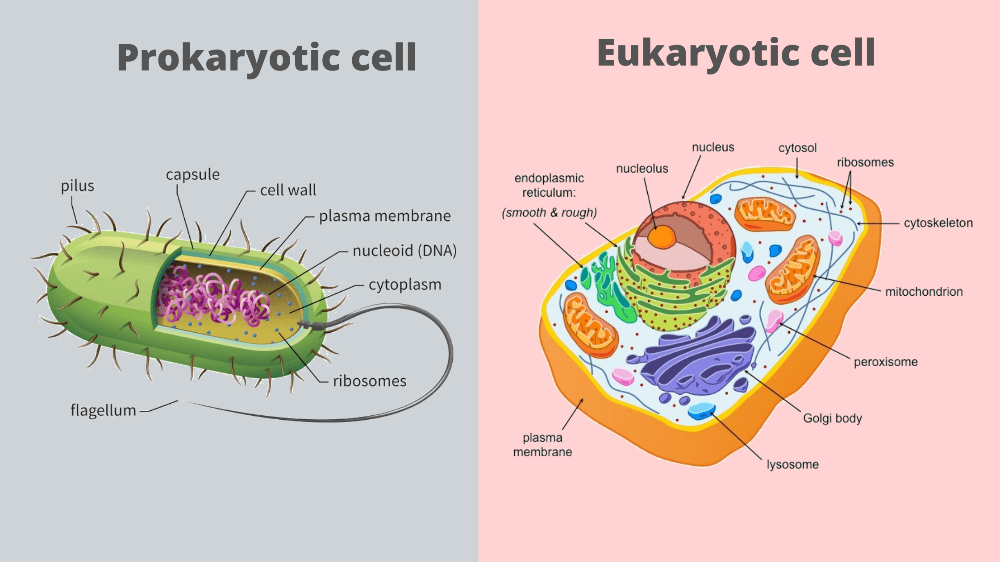{width="70%"}

What is the relationship between these cells? We know that all cells come from pre-existing cells. But how does one kind of cell "become" another kind of cell? In truth, that's not exactly how it works. Remember that all cells contain DNA, and DNA provides the instructions for for the cell's building blocks (in general, proteins). An organism cannot change its own DNA, and it cannot force specific mutations to happen. But, when a cell replicates (more on this in Unit 4!), sometimes little mistakes are made in copying the genetic code. Many times, these mistakes are not great and maybe the cell isn't viable. Sometimes, the mistakes are neutral and nothing happens. But every once and awhile a mistake is good, and it sticks around.

If a good mistake comes up, the cells that have that "good mistake" will make more copies of themselves. (That's essentially the definition of "good mistake"---leaving more offspring relative to others without the mistake.) Over time, that "mistake" increases in frequency in the population. Of course, one mistake does not typically change one cell into a completely different cell. But many mistakes, over thousands or millions of years, can definitely accomplish this. Think about the Grand Canyon: water flowing over rock is not going to carve out anything substantial in ten or even twenty years. But over millions of years, small things can add up to big things! (Another good example is the movement of the continents. A few centimeters a year seems like nothing, but look at the difference between Earth today and Pangaea.)

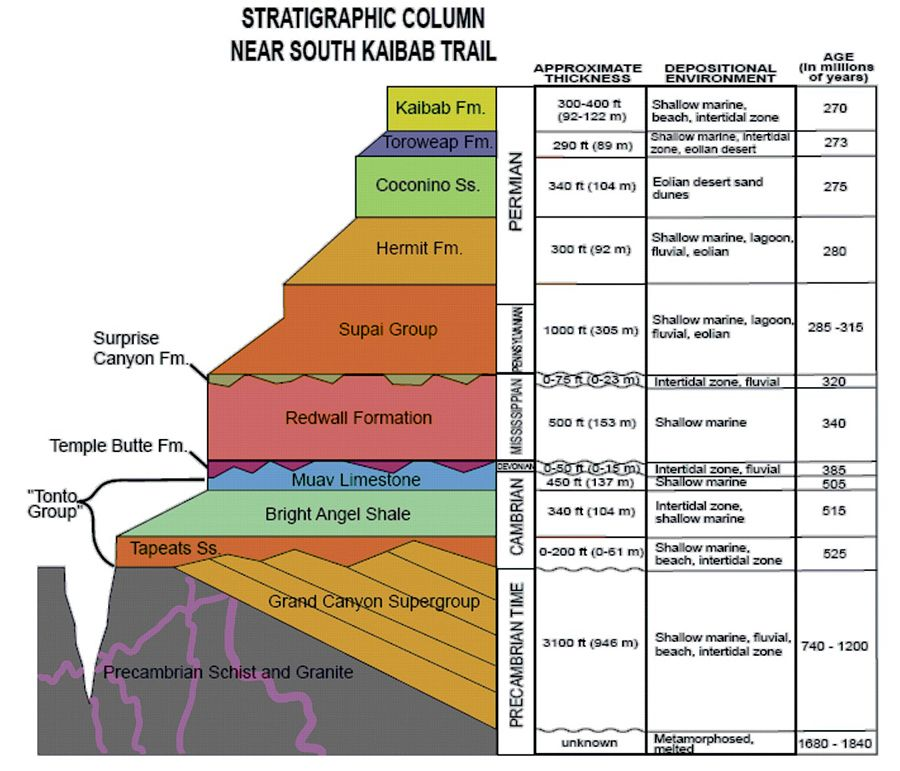{width="65%"}

Okay, so let's get back to the two main types of cells. How do we go about figuring out the relationship between these cells even though they likely originated billions of years ago? This part is kind of fun. Essentially, we take advantage of the fact that within certain genes, mistakes can almost _never_ be made. For example, there are specialized proteins that are responsible for making other proteins, called **ribosomes**. (More on this next lecture.) But ribosomes need to have a _very_ specific structure otherwise they won't work---and if a ribosome doesn't work, the organism is dead! So there are very limited mutations that can occur in which the organism can still survive; we call this kind of gene **highly conserved**. So some scientists thought, _Hmmm, that's very interesting, what if we look at the differences in the DNA sequence of different ribosomes?_

Once you do that, you can organize these sequences so that the ones that are most similar are closer together and the ones that have more differences are farther apart---essentially, in evolutionary time. This method was the first to demonstrate that there are actually three domains of life: bacteria, archaea, and eukaroytes. While there is still uncertainty, current models indicate that bacteria and archaea (both prokaryotes) evolved first from a common ancestor, while eukaryotes evolved later, likely from archaen ancestors. We will discuss in the next lecture the evidence for this hypothesis. But a major part of it is that prokaryotic organisms appear similar to the fossil microorganisms that represent evidence of the earliest life on Earth. 

.)](images/extremophile.jpeg){width="95%"}

Moreover, some prokaryotic organisms live in similar conditions to those thought to have existed on early Earth---we call them **extremophiles**, and they survive in places like hydrothermal vents in the bottom of the ocean. Prokaroytes are also simpler cells than their eukaryotic counterparts. They are also a lot smaller. (A lot smaller. You have more bacterial cells living in your body than your _own_ eukaryotic cells!) All prokaryotes are single-celled organisms. If you are a multicellular organism, you are a eukaryote. So let's take a look at the prokaryotic cell.

### The structure of prokaryotes {-}

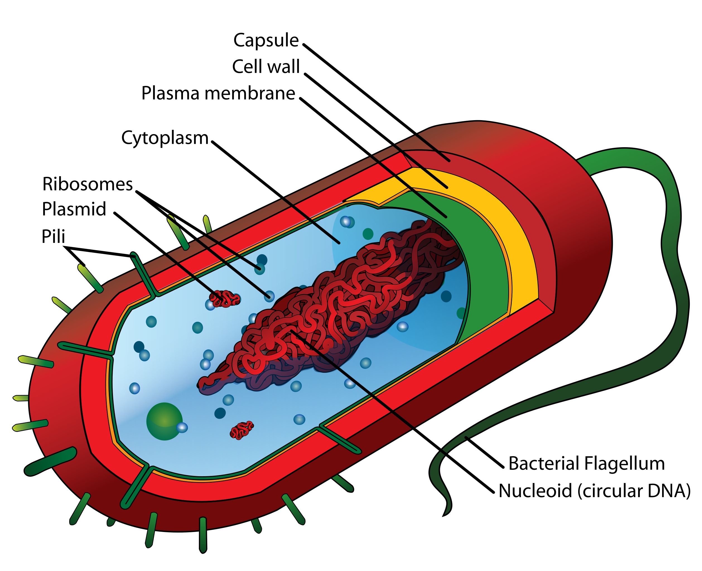{width="45%"}

**Prokaryotic cells** lack membrane-bound organelles. What that means is there are no internal compartments in a prokaryotic cell and there is no nucleus that houses DNA. There is a region where DNA is concentrated called the **nucleoid**, but everything that allows for replication and energy capture are either floating in the **cytosol** (the liquid matrix that makes up the cytoplasm) or in the cell membrane instead of in discrete compartments. In eukaryotes, there are organelles that carry out different functions and that are bound by membranes.

In addition to a plasma membrane (remember, all cells have them!), prokaryotic cells also have a **capsule** that prevents the cell from drying out and also allows it to "stick" to its surroundings. Under that, you find a **cell wall**, that maintains the cells shape and protects the interior. Underneath those two layers, our friend, the plasma membrane.  

### The earliest prokaryotes in the fossil record {-}

It's really hard to interpret old fossils. And when I say old fossils, I'm talking 3.5-4 billion years old. Which is to say that there are still debates about how exactly we know a fossil was "alive" or not. What if it was just a collection of organic materials but otherwise abiotic, or nonliving? How can you tell the difference from a rock that's billions of years old? Here it is in fancy science language from a fancy science journal (_Nature_, 416, pages 73–76 [2002]):

>Because such microorganisms are minute, are preserved incompletely in geological materials, and have simple morphologies that can be mimicked by nonbiological mineral microstructures, discriminating between true microbial fossils and microscopic pseudofossil ‘lookalikes’ can be difficult.

So what's a scientist to do? Basically, we're still doing the same thing that Hooke and Leeuwenhook did in the 1600s. We're building better and better ways to see things that our human eyes just can't see. I won't get into all the technology behind the methods,[^8] but the earliest evidence of life appears in fossils of microorganisms that were mineralized in 3.5 billion-year-old Australian rocks. But are these prokaryotes? Not... really. It's not actually clear when a cell that looks like a modern-day prokaryote emerges. Early life is messy, and it's also hypothesized that there were cells sharing genes _not_ by descent, called **horizontal gene transfer**. We'll discuss this later on, but for now, it means that the very early tree of life looks something tangled, like you see in the figure below.

.svg).)](images/tangledtree.png){width="35%"}

## 10: Eukaryotic Cells {-}

Prokaryotes belong to the domains Archea and Bacteria. These domains include a wealth of single-celled organisms. All multicellular organisms (and a few single-celled ones too!) belong to the domain Eukarya---this is all fungi, plants, animals. But the thing is, the prokaryotes of Archaea and Bacteria are no more related to each other than they are to the Eukaryotes. We simply distinguish the two different _cell types_, those with membrane-bound organelles and those without. But that doesn't mean those cells are more related to each other. We suspect that the eukaryotic cell type was derived from a prokaryotic cell type, in part because eukaryotic cells are larger and more complex, and for a few other reasons that we'll get into shortly. But did eukaryotes share a common ancestor with bacteria or archea? This is still an open question.

{width="40%"}

But before we get into the complicated family dynamics of cells, let's first take a tour of a classic eukaryote. We'll take a tour of both an animal and a plant cell, but keep in mind that these are broad generalizations and there are _many_ types of eukaroytic cells with different structures and numbers of organelles. (Although, cells only have one nucleus. But they can have different numbers of mitochondria, of ribosomes, etc.)

### The structure of eukaryotes {-}

You probably all know that the **mitochondria** is the powerhouse of the cell. I think that's just about the only fact that everyone remembers from high school biology. We won't focus on that organelle here, except to confirm that yes, it is the powerhouse of the cell. We will discuss it in more detail in the next unit when we learn about metabolism. Plant cells also have mitochondria, but they slso have something called a **chloroplast**. These organelles are the site of photosynthesis (the process that allows plants to capture energy from the sun and turn it into chemical energy), so we will also discuss that in Unit 3. 

.)](images/endomembrane.png){width="42%"}

For now, we will focus primarily on the **endomembrane system**, which is essentially all the different membranes of the eukaryotic cell that serve to divide it into functional and structural compartments. In high school, we usually learn about each organelle as a discrete entity that has a particular job. But the cell is much more unified than that, and highly coordinated. I often think about the eukaroytic cell as a series of connected membranes that work cooperatively to perform essential tasks. The network of membranes are either directly connected, or connected through the action of **vesicles**. Remember how we learned that phospholipids in water can spontaneously form vesicles? These are basically like little ships that can transport materials.

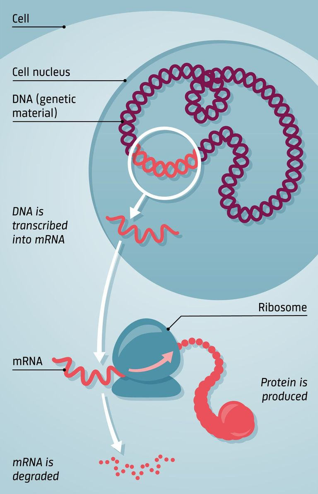{width="30%"}

So let's start first with the **nucleus**. If there are any Star Trek fans out there (LLAP!), I usually like to think of the cell as a space station (think: Deep Space 9), and the nucleus is like the computer. Meaning the nucleus, just like the computer, holds all the instructions. Now, without _executing_ the instructions, the computer is kind of meaningless. When your laptop is just sitting on your desk it doesn't do anything---you need to tell it what to do. The truth is that DNA doesn't really go anywhere and it doesn't do much in the cell. It sits in the nucleus. Typically many other molecules do the job of opening DNA strands up to the right gene, copying the right gene, and taking the right gene to the place where proteins are made. So instead of dragging you through---yet again!---the basic tour of the eukaroytic cell, let's talk through what happens when we want to make a protein from a particular gene house inside the nucleus. Let's say this is a _secretory_ protein, meaning that we are going to make this protein and then it will be secreted outside of the cell through the plasma membrane.

First, all the DNA that makes up your entire genome exists within every single cell in your entire body. That means there is A LOT of DNA in your body; I've read enough to stretch from here to the sun (93 million miles), _and then to Pluto and back_. Think about it for a second: how do we actually fit all that DNA inside of our bodies? Of course, DNA is small, so that helps. You can't see DNA with the naked eye. But even something very small, in large quantities, can be hard to store. So it's packed _very_ tightly around special proteins called **histones** into **chromatin**, which is then organized into separate **chromosomes**. Very, very tightly packed. So tightly packed that in most of your cells, the majority of your genome is tucked away and not accessible for making proteins. And that's okay! Because a heart cell really doesn't need the instructions for making a toe cell. Different cells only need access to the genes that are relevant to their function, not every gene in the entire body.

If we want to make a protein, we first need that area of the genome to be unwound so that special proteins can access it and make a copy of it. Those special proteins enter the nucleus, attach to the gene of interest, and make a molecule called **messenger RNA** or mRNA. Because our DNA never leaves the nucleus, it's the mRNA copy that heads out into the cytoplasm. From there, the mRNA finds a **ribosome**, special machinery that makes proteins using mRNA and **transfer RNA** (tRNA), which brings the right amino acids needed to build the protein.

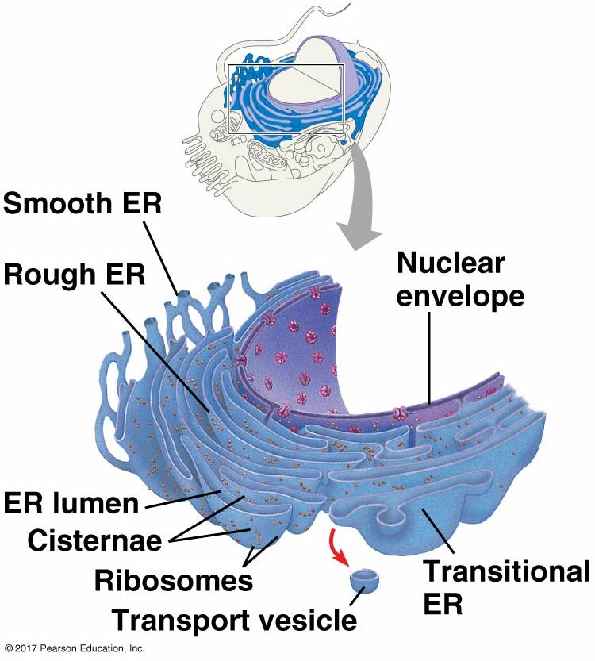{width="35%"}

The **endoplasmic reticulum** (ER for short) is basically the actual transportation system of the cell (network of turbolifts, if you're still with me on the space station), although it does a few other jobs like protein folding. It forms an interconnected network of flattened, membrane-enclosed sacs known as **cisternae**. The ER is made up of two subunits: **rough ER**, with an outer surface studded with ribosomes, and **smooth ER**, which lack ribosomes on the outer surface. (The smooth ER is responsible for synthesis of lipids, metabolism of carbohydrates, detoxification of drugs and poisons, and storage of calcium ions.) The rough ER is responsible for the production of many proteins, particularly in cells whose job it is to secrete proteins into the bloodstream. After secretory proteins are produced, they are kept separate from other proteins and transported out of the ER wrapped in the membranes of vesicles that bud off from a special area of the ER. 

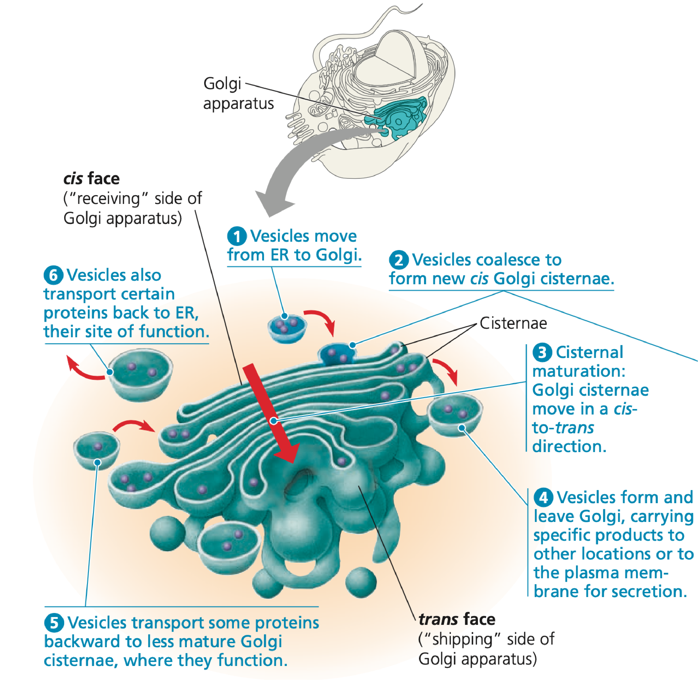{width="70%"}

After leaving the ER, the next stop is the **Golgi apparatus**, which is largely responsible for packaging and transport. I think of this like the docking ring of the space station: essentially, it modifies proteins received from ER vesicles and packages them for shipment outside of the cell. The Golgi is also responsible for lipid transport and **lyososome** formation, which degrades and recycles unnecessary cellular components.

### Plant cells and animal cells {-}

Plant cells and animal cells are more similar than they are different. You share a lot more in common with a rose bush than you do with bacteria. The common ancestor of eukaryotes that gave rise to groups of plants and animals likely had some shared features that were maintained in these two groups; also, over time, the two groups evolved separately. The main differences between plant and animal cells are:

1. Plant cells have a cell wall with plasmodesmata for communicating with adjacent cells
2. Plant cells contain chloroplasts along with chlorophyll, specialized pigments for capturing sunlight
3. Plant cells have a large central vacuole (usually a large compartment filled with water)

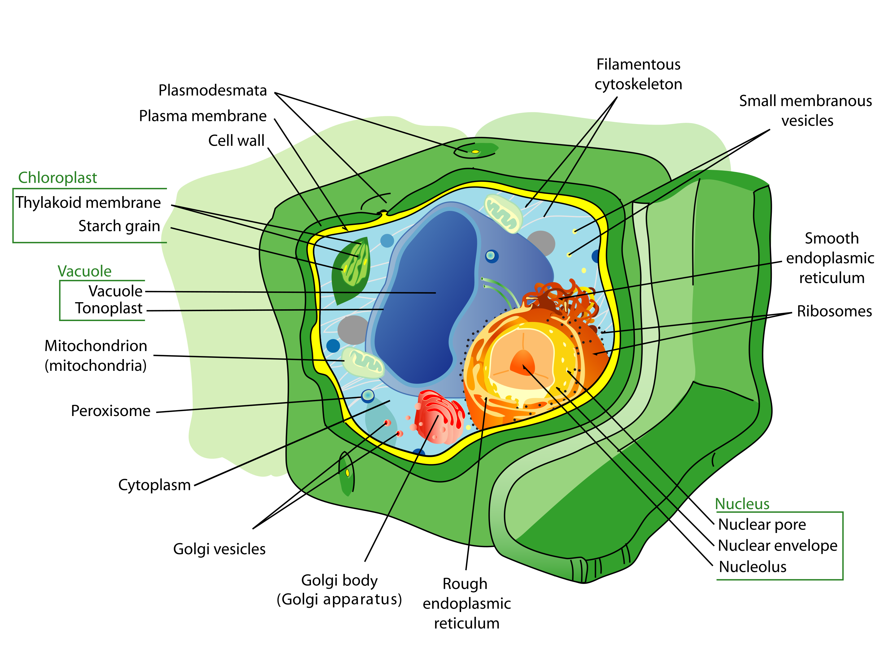{width="65%"}

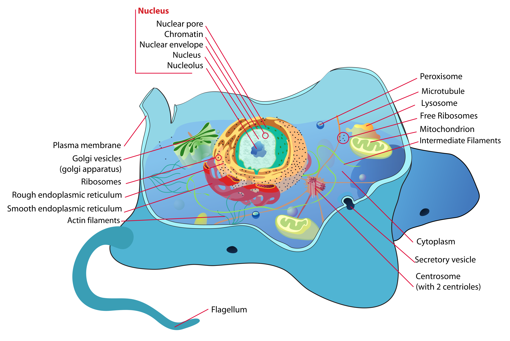{width="60%"}

### The relationship between prokaryotes and eukrayotes {-}

There are a lot of arguments here, if I'm being honest. And by arguments, I mean hypotheses. This is what science is all about! We propose ideas based on our observations, and then we design tests to examine these hypotheses more closely, and then people argue about the hypotheses and about the data a lot until we settle on a consensus. Sometimes we never settle on a consensus. (Remember: what even is life?) Sometimes a consensus becomes obvious after some key information becomes discovered. For instance, many folks argued about how heredity worked, but the arguments started to stop soon after Gregor Mendel's work in pea plants was re-discovered. But the time when we are actively working on stuff---like the origins of life---usually involves a lot of difficult or complicated data, or worse, no data at all, and varying interpretations about what that data could mean.

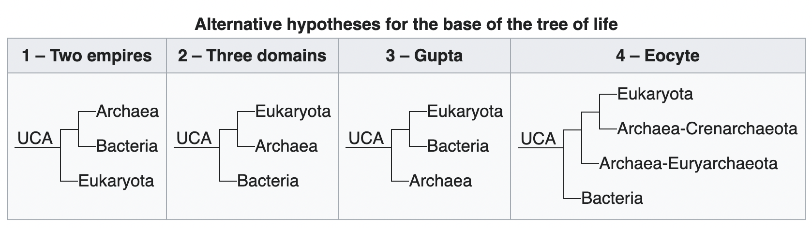{width="85%"}

A common hypothesis of the origin of modern eukaryotes is that some kind of "protoeukaryotic" cell engulfed a prokaryotic cell. Instead of digesting it, these two cells began to work together in a mutualistic relationship. What was this prokaryotic cell that got engulfed? You would know it today as the mitochondria, the powerhouse of the cell. Mitochondria have membranes that are more similar to bacteria than to eukaryotes; mitochondria have their own circular DNA; mitochondria have their own ribosomes; mitochondria make copies of themselves similar to how bacteria reproduce. For all these reasons, the **endsymbiont hypothesis** is one of the most strongly supported hypotheses. We also think that at some later point, this cell engulfed another prokaryote that was capable of harnessing energy from the sun, which would eventually become the chloroplast. (See the diagram on the following page.)

Another hypothesis is that Bacteria, Archaea, and Eukaryotes all represent different lines of descent from a very early colony of ancestral organisms. Maybe even before cells existed, we're talking primordial soup days, when there could have been a lot of horizontal gene transfer and mixing of various molecules. Eventually certain genes were "fixed" in certain populations, which over time ultimately gave rise to the three modern-day kingdoms. Above is a summary of the various evolutionary relationships (from [Wikipedia](https://en.wikipedia.org/wiki/Eukaryote#Relationship_to_Archaea)). There is currently no consensus, but numbers two and four are the most favored by current researchers in the field.

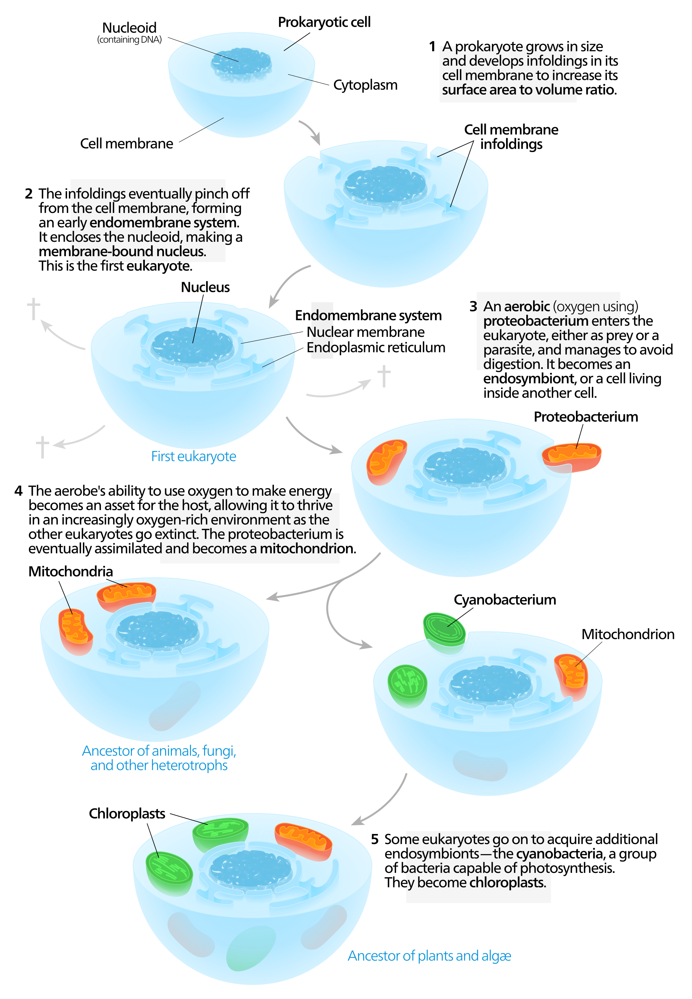{width="85%"}

## 11: Why Membranes First? {-}

What are the features that all of us living organisms on Earth share? Forget for a moment the difficult task of defining "life" in general terms, let's just think about the commonalities we can point to in extant organisms. The first is that all living organisms are composed of cells---which is to say, we all are composed of compartments of various complexity. Another way to say this is that we all have cell membranes. All living organisms contain DNA, and all living organisms essentially use the same twenty amino acids to construct proteins. That's kind of wild if you think about it. From four base pairs and twenty amino acids we get all the billions of creatures that have lived on Earth. All living organisms have ribosomes. All living organisms use something called **ATP**, which we say is the "currency" of energy. Not only do all organisms have a metabolism in which they harvest energy from their surroundings, but they also _all_ make ATP to use that energy meaningfully in their cell(s).

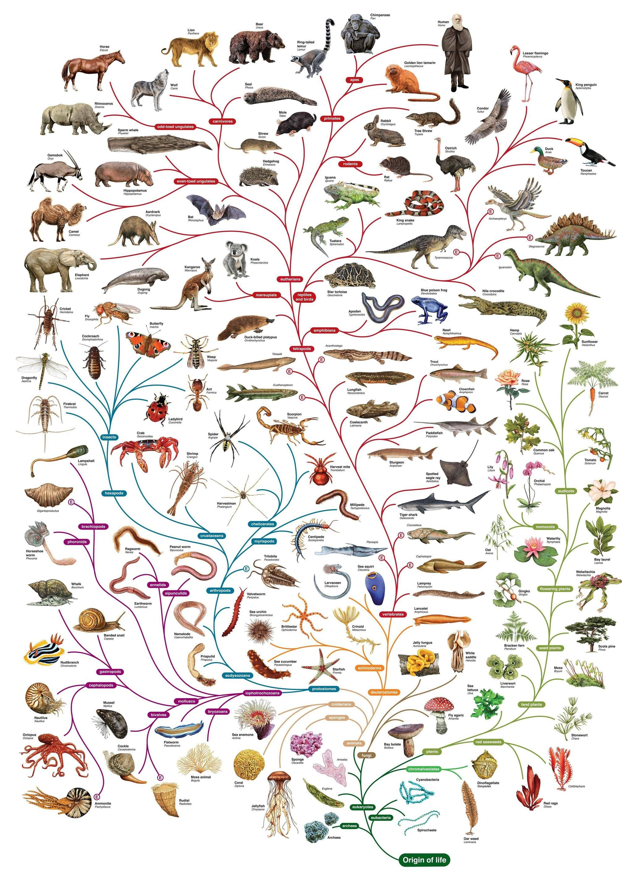{width="60%"}

There is a lot of evidence that demonstrates that all living organisms descended from one common ancestor. Of course, we can trace fossils through time. We can observe the differences in organisms as continents split apart and such organisms evolved separately---while still observing the features they continue to share. We can sequence the DNA of organisms and compare that DNA to other organisms, using that information to determine how close or distantly related those organisms are to each other. While there is still a lot to learn about the processes that shaped the diversity of organisms on Earth, data from hundreds of disciplines and millions of studies all corroborates this basic fact: _we are all related_. (We can also observe the process of evolution occurring in real-time in populations of bacteria or fruit flies, but that's a story for another day.)

It becomes trickier when we search for the answers to more ancient, deeper questions like how life first emerged. We don't know exactly what the conditions on early Earth were like. We don't know exactly what molecules or atoms were here, or exactly how they got here. There could have been thousands or millions of different iterations of early life forms or cells that all went extinct, before the one that survived and gave rise to all of us. Another thing to keep in mind is that just because a lineage is "older," like bacteria in comparison to eukaryotes, does not mean it has "stopped evolving." The collection of genes among bacteria are still changing, and bacteria are still adapting to their environment! Some genes are highly conserved and change very little. But plenty of genes are not highly conserved. Mutations occur all the time, and there are likely many genes that have been lost or changed substantially over time. Not to mention, horizontal gene transfer makes it challenging to tease apart which groups are related to whom and how. (It is hypothesized that this is why eukaryotic organisms share genes with both Bacteria and Archaea, despite Archaea being sister to us.)

### What lipids bring to life {-}

Let's review the processes that we discussed as essential to the definition of "life": homeostasis, organization, metabolism, growth, adaptation, response to stimuli, and reproduction. Of course, some of these processes also occur in non-living entities, but taken together, you generally get a real living organism. I would argue that compartmentalization is necessary for five of these.

1. Homeostasis---where the internal environment is regulated---is not possible if there is no "internal environment."
2. Organization is not possible without compartmentalization.
3. While metabolic reactions can occur without cells or compartmentalization in general, the way that most living organisms capture energy through cellular respiration or photosynthesis is dependent on the presence of membranes. (We learn more about this in the next unit.) Moreover, performing multiple chemical reactions at the same time without interference definitely requires compartmentalization.
4. An organism cannot grow without having an ordered structure from which to grow.
5. Replication is possible without compartmentalization, but reproduction---the production of new organisms from existing ones---requires compartmentalization.

I didn't include response to stimuli, and I'm torn on it. In one sense, chemical reactions must be responsive to the environment within which they occur, regardless of whether or not there is a compartment. But one of the important features of a membrane is that there are special proteins and carbohydrates on its surface that allow the cell to gather _information_ about the environment and adjust its internal processes based on that information. So in another sense, compartments may also be necessary for response to stimuli. Like many things, it comes down to exactly how you define each of these components, and there is room for varying interpretations.

But why did I leave out adaptation? As we'll learn in Unit 4, all you need for adaptation to occur is stored information (e.g., DNA) that is replicated with some error rate. Basically, all you need is coded information that is imperfectly replicated. (If this sounds confusing, bear with me until Unit 4!)

Now, just because we need membranes for five (or six?) of the seven characteristics necessary for life does not say anything about whether or not membranes came first in life's origins. We are using evidence based on what we currently observe to form conclusions about past events. That is not good science! All this tells us is the membranes are an important aspect of living organisms as we know them on Earth. I think this is likely why the encapsulation hypothesis has persisted in the literature for some time: compartments seem fairly critical to what we know of as "life." Imagine that you took all the cells of the world and dumped their contents into our lakes and oceans. We'd have a lot of cellular building blocks in there, but no life. Put another way:

>The discrimination between inside and outside, applicable to compartments, is the first structural prerequisite for the living cell and the living in general.  
_Luisi, 2006, pg. 185_

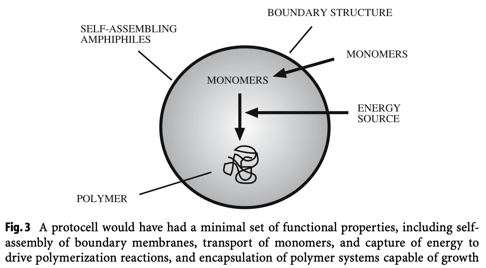{width="70%"}

Prebiotic compartments that contain molecules undergoing chemical reactions are generally referred to as **protocells**. Many have hypothesized different variations on what a protocell actually is and whether or not it constitutes "life." But in general, the story goes something like this: in the prebiotic soup, there are organic molecules. Whether these organic molecules came from space (e.g., comets or asteroids) or were assembled through chemical reactions is not known. Amphiphilic molecules assemble into various structures, and occasionally capture other organic materials. Some of these compartments will ultimately contain chemically reactive molecules. Over time, compartmentalization would allow for organic molecules to exist in close proximity, potentially leading to some kind of metabolism. Perhaps the complexity of these protocells is able to increase over time, leading to an ability to replicate components.

Okay... but how do they replicate? How can they possibly replicate, without instructions for their components? And moreover, how do they replicate without a sustained energy source?

### What is missing in a lipid world {-}

One of the first things we need to wonder about is how the heck we got the lipids in the first place. I'm no chemist, but from what I understand, branched carbon chains[^9] are more likely to emerge from the prebiotic soup rather than long chains. And remember, phospholipids are made from long fatty acid tails, which are just long hydrocarbon chains.[^10] We already know that lipids as they exist today were not in the prebiotic soup---but other amphiphilic molecules consisting of long chains will also do the trick. But where exactly these early amphiphiles came from is not known. One hypothesis is, surprise, that they came from space: molecules consisting of only hydrogen and carbon (alkyl groups) have been found on meteorites. Although these molecules could not spontaneously form amphiphiles on their own, it's a starting place for possible prebiotic chemistry on Earth. But the fact remains that we do not know how the lipid-like molecules required for encapsulation originated.

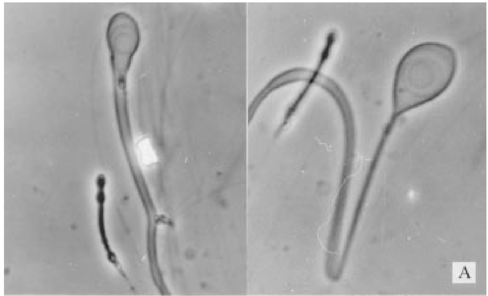{width="40%"}

Another thing we should wonder about is how we go from a spontaneously formed compartment to a cell that is capable of reproducing. In order to reproduce, there must be instructions. How could we build the same kind of structure with any consistency if we didn't have instructions? Some have argued that it may be possible for the lipids themselves to provide the instructions. The first important point is that there is a diversity of lipids in general. As in, there are lots of different kinds of lipids. The second has to do with the way that membranes grow. Essentially, this occurs through an addition process where the original membrane is used as a template. Once more lipid-like molecules are added, eventually the membrane becomes large and undergoes "division." 

And the last thing we will wonder about is how we go from compartments to organized energy capture in the form of cellular metabolism. Remember that entropy in the universe is increasing. When a chemical reaction occurs---if it occurs spontaneously---it results in a release of energy and less-ordered products. But remember that life takes a constant input of energy. When we are at equilibrium with our surroundings we are dead. So encapsulation alone is certainly not enough for the maintenance of life---it requires a sustained series of metabolic reactions. Capturing some stuff inside some lipids is not the same as sustained metabolism, because it doesn't allow for consistent capture of energy. And you cannot have life without that.

<!-- ALSO, THERE IS SOME SHIT ABOUT HOW WHEN YOU GROW A MEMBRANE YOU USE THE ORIGINAL MEMBRANE AS A TEMPLATE?? -->
<!--  This in contrast to the output of simulated prebiotic chemical reactions, which typically produce very heterogeneous mixtures of compounds.[269] Within the hypothesis of a lipid bilayer membrane composed of a mixture of various distinct amphiphilic compounds there is the opportunity of a huge number of theoretically possible combinations in the arrangements of these amphiphiles in the membrane. Among all these potential combinations, a specific local arrangement of the membrane would have favoured the constitution of a hypercycle,[270][271] actually a positive feedback composed of two mutual catalysts represented by a membrane site and a specific compound trapped in the vesicle. Such site/compound pairs are transmissible to the daughter vesicles leading to the emergence of distinct lineages of vesicles which would have allowed Darwinian natural selection.[272] -->

<!-- Given current evidence, there are only two presumed cellular ancestors -->
<!-- of eukaryotes: the archaeal lineage whose descendant -->
<!-- was the putative host of the mitochondrial endosymbiosis and the alphaproteobacterial ancestor of mitochondria. -->

<!-- + Summarize evidence for the lipid world -->
<!-- + Why membranes are important for the origin of life -->
<!-- + But encapsulaton alone does not account for the energy needed to maintain ordered structures in a universe driven toward entropy! -->
<!-- + basically go back to the list of things needed for life, membranes account for like two of them -->

[^8]:  laser-Raman spectroscopic imagery, if you're curious
[^9]: Instead of a chain of carbon like C--C--C--C--C--C, a branched chain can have a shape like a "T" (or other shapes), where carbon is bound to other carbons in the center of the chain.
[^10]: You need at least ten carbons in a chain to get the spontaneous generation of things like lipid bilayers and vesicles.