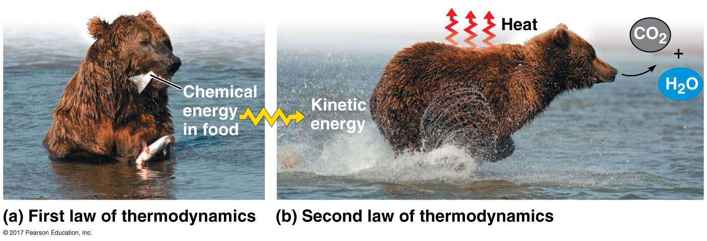
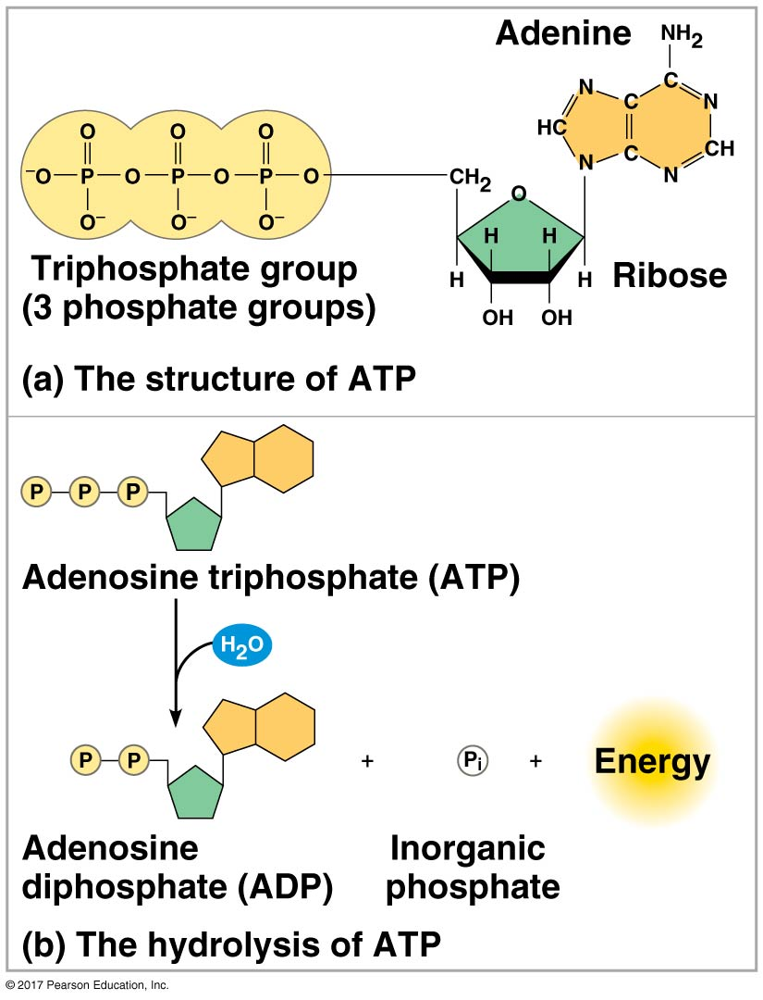
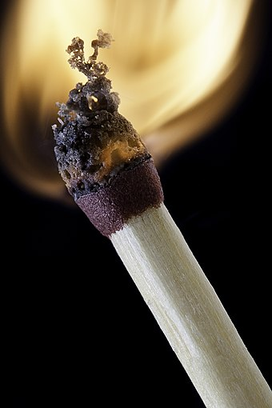

# Metabolism

>I merely took the energy it takes to pout and wrote some blues.  
_Duke Ellington_

\vspace{10mm}

[[**ACCESS UNIT 3 LECTURE MATERIALS**](https://drive.google.com/drive/folders/1cA02sCRImZBP32oCsY5VhCBcxPyw0qNt?usp=sharing)]

\vspace{6mm}

## 12: The Catabolic World and Energy {-}

We've been getting at this for a long time throughout the course: living ain't free. We know about how atoms are constructed, and how their construction gives rise to properties that influence the way they interact and form molecules. We know that from this arises special molecules---biological molecules---that build the substances that make life possible. We have toured the two types of cells and discussed some of the jobs those cells carry out, the jobs of life. Where do we get the energy from life? We get it from the sun. Seriously. The sun powers all life on Earth. But we are not solar panels. So how do we actually harness that energy from the sun so we can use it? That's a big part of being alive: taking the energy from this thing, and using it for that thing.

{width="40%"}

We also know how much living organisms have in common. And all living organisms need energy to live. We know this intuitively, because if we don't eat food, we die. What are we getting from food? We are getting energy and supplies to perform the work necessary for us to continue surviving. This was a major component missing in our exploration of the lipid world: it's great that lipids spontaneously form boundaries, and boundaries are definitely necessary for most of life's processes. But where do we get the _energy_? To look at a cell today, it's hard to imagine how such a complex ballet of chemical reactions originated. And I'm not even talking about multicellular organisms, that have billions of cells, all performing their own complicated dances. The fact is that we don't know a lot about the origin of cellular metabolism.

While we know how essential boundaries are to life, some scientists argue that perhaps it was metabolism that originated before true living organisms. Metabolism is essential for the maintenance of life---in particular, the ability to generate the building blocks necessary for growth and reproduction---because this allows the organism to exist somewhat independently from a changing environment. If you rely solely on the immediate surroundings for all the pieces necessary to grow and reproduce you'll eventually run into problems. First, you'll burn through whatever is in the immediate surroundings at some point. (It's not like there are an infinite amount of amphiphiles in prebiotic soup.) Second, you can never colonize a new area. So for life to transcend the realm of random chemical reactions constrained to a specific area, we need metabolism.

In every organism we know of, the core structure of the metabolic network is extremely similar. You will even notice some similarities between cellular respiration and photosynthesis later in this unit. Because the metabolic network thus appears highly conserved, its suggested that it arose very early in the origin of life. But, remember that this can be misleading: there is a difference between the first living organism, and the organism that gave rise to every extant organism (our common ancestor)---these need not be the same! Perhaps the first living organisms are long extinct, and we are remnants of a derived population. But anyway, let's consider these two hypotheses[^11]:

1. modern biochemical reaction sequences are the result of evolutionary selection, and thus are likely very different than the first metabolic systems, or
2. the initial metabolic reaction network was pre-established on the prebiotic earth and was consequence of the chemical and physical environment when life first emerged

Evidence in favor of the second hypothesis would then suggest that the basic reaction sequences present in modern metabolism may still be similar to those of the first living organism. So now let's take a look at metabolism and learn about some of the important kinds of chemical reactions that power all life.

### What is metabolism? {-}

**Metabolism** is the sum total of all chemical reactions carried out by living organisms. There are three main jobs carried out by various metabolic pathways:

1. converting energy from food into energy that can power cellular processes,
2. converting food into biological molecules that can be used as building blocks for the cell, and
3. eliminating waste from metabolic processes.

{width="60%"}

So then, how does metabolism actually function? Enzymes, which are special proteins, catalyze reactions in intersecting **metabolic pathways**, where a molecule is altered in a series of defined steps, resulting in a product. These can be **catabolic** (breaking down molecules, releasing energy) or **anabolic** (building molecules, consuming energy). Entropy is constantly increasing in the universe. But living systems are composed of highly ordered structures. This increase in order is ultimately balanced by living creatures taking in organized forms of matter from their surroundings and replacing them with less ordered forms. We eat proteins, and produce waste like feces, CO~2~ and H~2~O. During metabolism, the depletion of chemical energy is accounted for by the generation of heat. If you've ever been in a packed room with lots of humans, you'll know how much heat we can generate just by standing there.

{width="70%"}

### Special kinds of reactions {-}

There are a lot of different kinds of chemical reactions. But for now, we're going to focus on one kind, called a redox reaction. In a **redox reaction**, electrons are transferred from one reactant to another reactant. Basically, you can think of these reactions as the transfer of electrons. Rememeber that electrons have a negative charge, so when something gains an electron, its charge is _reduced_. So we say that the addition of electrons is called **reduction**. When something loses electrons, it becomes more positively charged. I wish I could say that we call this something intuitive or smart, but we call it **oxidation**. The reactant that donates the electron is called the **reducing agent** and the substance that accepts the electron is called the **oxidixing agent**. Redox reactions must always occur together, because one substance must transfer the electron and one substance must accept it.

Okay, who cares? Well, these reactions are important because they are the main source of energy for biological organisms on the planet. Also, they are the main source of energy for a bunch of other stuff too, like fire, and also how your car runs on gasoline. Photosynthesis, cellular respiration, combustion, corrosion... all of these processes are actually redox reactions. Rust is basically just the oxidation of metal---we call this oxidation, iron gives its electrons to oxygen, which is a very powerful oxidizer (ha ha). So ultimately we care about these kinds of reactions because they essentially power everything. There is a lot of energy to be made in transferring electrons around.

Now, in an isolated system, all reactions will eventually reach an equilibrium. Once an equilibrium is met there is no more energy left to perform work. Chemical reactions that occur in a test tube will eventually stop as they reach this equilibrium. But if you were to reach equilibrium with your surroundings you would be dead. As I've said, in metabolic terms, equilibrium is the same as death. But of course, we are not dead, so how does that work? All living organisms require a continual input of energy to maintain the multitude of metabolic reactions in a state far from equilibrium. The key to maintaining this lack of equilibrium is that the product of a reaction does not accumulate but instead becomes a reactant in the next step until waste products are expelled from the cell.

{width="80%"}

We know that some reactions build things up, and some reactions break things down. We use a mathematical equation to describe $\Delta G$, which is called the change in **free energy**. $\Delta G$ can be measured for a reaction, and once we know its value for a particular chemical process, we can use it to predict if the reaction will be spontaneous---occur on its own---or not. A **spontaneous reaction** is energetically favorable and will occur without any input of energy. Essentially, $\Delta$G must be negative, meaning energy is released from the reaction. All spontaneous processes decrease the system's free energy. Processes that have a positive or zero $\Delta G$ are never spontaneous because they require a positive input of energy. 

Now that we understand $\Delta G$, we can understand more about the kinds of metabolic reactions that can occur. Either they require energy, meaning energy must be added, or they release energy. An **exergonic** (prefix _ex_ means "out") reaction occurs spontaneously and releases energy, meaning $\Delta G$ is negative and the chemical mixture loses free energy. An **endergonic** (prefix _en_ meaning "in") reaction requires energy, does not occur spontaneously, and $\Delta G$ is positive. This kind of reaction will absorb free energy from the surroundings. The size of $\Delta G$ represents the amount of energy that would be required for the reaction to occur. 

{width="45%"}

So let's quick put a few concepts together. Catabolism, the breaking down of molecules, usually releases energy and is thus exergonic. Anabolism, the building of molecules, usually requires energy and is endergonic. Metabolism is just a series of catabolic and anabolic reactions, producing energy, consuming energy.

### The currency of metabolism {-}

We will talk a lot more about ATP when we discuss cellular respiration. For now, we will simply introduce the structure of ATP and explain in broad terms how ATP is **hydrolyzed** (broken down) to release energy. **ATP**, otherwise known as adenosine triphosphate, contains the sugar ribose, with the nitrogenous base adenine, and a chain of three phosphate groups. ATP is built from carbohydrates, nucleic acids, and phosphate groups! Fun fact: organic phosphate can react with water and release energy. What I mean is that bonds between the phosphate groups of ATP can be broken by hydrolysis. When this happens, a molecule of inorganic phosphate (HOPO~3~^2-^, usually abbreviated as P~i~) leaves the ATP, which becomes adenosine diphosphate, or ADP. The reaction is exergonic and releases 7.3 kcal of energy per mole of ATP hydrolyzed. Why does this reaction release so much energy? It's not because the phosphate bonds are especially strong. Rather, it's because the phosphate groups are negatively charged. Because the same charges repel each other, when they are crowded together it causes instability in that region of the molecule. I've seen this described as a compressed spring, ready to pop.

{width="40%"}

ATP is a renewable resource that can be regenerated by the addition of phosphate to ADP. The free energy required to phosphorylate ADP comes from exergonic breakdown reactions (catabolism) in the cell. This shuttling of inorganic phosphate and energy is called the ATP cycle. It is common in living organisms to couple an energy-yielding (exergonic) process with an energy-consuming (endergonic) process.

## 13: Enzymes {-}

There is a lot of energy in gasoline. We know this, because we pay a lot of money for it so that we can drive our cars around. But we also know that if we just lit gasoline on fire, it would explode and we couldn't harness the energy inside of it to do anything meaningful. This is the idea behind metabolism---instead of gathering energy explosively, we want to gather it in steps so that we can actually use it to perform work in the cell. The thing is, if we examine life from the perspective of _thermodynamics_ as opposed to simply _chemically_, we may wish to form a different argument about life's origins than what we have so far in our prebiotic soup. 

{width="70%"}

The argument goes that there is nothing "life specific" about the building blocks of life, in and of themselves. We have hydrocarbons, along with nucleic acids and amino acids. Maybe the fact that we find hydrocarbons in space, on comets, simply attests to the fact that these molecules are... ordinary. Because it's not the molecules that make us alive, it's the fact that we are highly ordered structures existing far from equilibrium with our surrounding environment. Here it is in fancy language:

>As pointed out by Erwin Schrödinger already in 1944, and even earlier by Ludwig Boltzmann as well as numerous further physicists and physical chemists ever since, all living entities share the same characteristics. They generate order, that is, highly structured and regulated networks of processes, from disorder, i.e., relatively randomly distributed chemical elements. Therefore, they are entropy-decreasing phenomena.  
_Minerals and the Emergence of Life, Duval et al., 2021_

We know that living organisms are able to do this because they are **open systems**, which is to say that they are constantly taking in energy from the surrounding environment and producing waste. The way us life forms get around the second law of thermodynamics is that we maintain our own order by increasing the overall entropy of the universe itself. Our limited _decrease_ of entropy is lower than the _increase_ in entropy of the larger system of which we are a part.

{width="60%"}

Okay, so all us living organisms need a constant influx of energy, and we use this energy to create order from disorder. As long as we maintain our own order relative to the larger system, we will need this energy, because we ourselves exist far outside equilibrium with our environment. So how do we achieve that? At the core of all living organisms is our cellular metabolism. How nutrients get absorbed and what particular nutrients are consumed depend on the organism, but all cells essentially carry out the same process once we get to the cellular level. It's called cellular respiration, and we'll learn all about this week. But we already know the currency of energy---the output of cellular respiration---a molecule called ATP. How organisms make that molecule and how it gives us energy relies heavily on the exploitation of electrochemical gradients, or electrical "tension." But what makes this possible? How are we powering highly specific reactions, many at the same time, at exactly the right time and place? Enzymes.

### What enzymes do {-}

Put simply, enzymes are proteins (some enzymes are RNA, but we'll talk about that in Unit 4). And what do they do? Basically everything. I'm a little bit kidding, but also every single life-sustaining metabolic process requires enzymes, because such processes would not occur at rates fast enough to do the "life-sustaining" part. But anyway, enzymes are **catalysts** that accelerate the rate of chemical reactions. They do this by lowering the **activation energy** required to start the resultant chemical reaction. 

Let's think back to our chemistry classes in high school (please, bear with me!!). We did all kinds of reactions with beakers and flasks and titrators and all that. But what else did we do? Well, we heated stuff up. Sometimes we cooled stuff down. Sometimes we added an acid or a base. All you really need to remember about high school chemistry is that in order to really "get stuff going," so to speak, we needed to change things like temperature or pH. Many reactions simply will not occur without this kind of input. But the problem is that the body maintains a pretty constant temperature, and it _has_ to maintain a constant pH, or we will die. So then, what's a body to do? The body can't increase the pH over here, or crank up the bunsen burner to boiling. That's where enzymes come in.

{width="60%"}

Enzymes are pretty amazing, because they make reactions trillions of times more likely to occur than they would without their presence. There is one example on [Wikipedia](https://en.wikipedia.org/wiki/Enzyme) where an enzyme catalyzes a reaction such that it occurs in seconds, whereas it would otherwise take millions of years to occur. This is why one of the main arguments against the prebiotic soup hypothesis is that spontaneous generation of some of these building blocks is so mind-bogglingly unlikely (statistically speaking) that it may well be straight up impossible. The fact is that enzymes are the workhorses that make the processes of life happen. They also regulate when and how reactions occur through their particular shapes and whether or not they are present or absent.

### How enzymes work {-}

Enzymes are highly specific to the reactions they catalyze---in other words, enzymes are specific to the "reactant" it acts on. In science terms, this is called **substrate specificity**, the reactant being the **substrate**. This is important, because many pathways have one particular enzyme that catalyzes one particular step. We need this kind of specificity if we are going to actually harness energy to perform meaningful work in the cell. Remember the gasoline analogy: we can't just set the glucose molecule on fire. We need to break its bonds in a controlled way, so that we can, metaphorically, power the car. In our case, "powering the car" means making ATP. ATP is the currency of energy, and the _particular_ currency is the electrical tension created when three negatively charged phosphate molecules exist in close proximity. All organisms exploit this tension to power life.

{width="70%"}

Enzymes bind to the **active site** of their substrate. This typically induces a conformational shift and the entire complex changes shape. Here are some of the methods that enzymes use to speed up (or catalyze) reactions:

+ if the reaction involves two or more reactants, the active site can help the substrates coming together in the proper orientation for the reaction to occur
+ when the substrate is bound to the active site, it can stretch and bend the substrate itself, because distorting chemical bonds allows them to be broken more easily
+ enzymes can create "microenvironments"---like a pocket of low pH---because of the R groups attached to the amino acids in the enzyme
+ speaking of amino acids, sometimes the side chains of amino acids in the enzyme directly participate in the reaction by binding to the substrate

### Regulation of enzymes {-}

In large part, enzymes can be regulated through inhibition. This essentially means preventing the enzyme from functioning in some manner. We will cover the two main kinds of enzyme inhibition, although there are others.

{width="50%"}

**Competitive inhibition**. A competitive inhibitor is a molecule that greatly resembles the substrate. If the competitive inhibitor is present, it will bind to the active site of the enzyme and prevent the substrate from binding. If the substrate concentration is high enough (much higher than the concentration of the inhibitor) then this kind of competition can be overcome.

**Non-competitive inhibition**. A non-competitive inhibitor binds to the enzyme in a location other than the active site. In doing so, it reduces the catalytic efficiency of the enzyme. The substrate can still bind, but this no longer has the same effect on the resulting chemical reaction. This kind of inhibition cannot be overcome with high concentrations of substrate.

For the next two lectures, we'll start looking at the most important cellular processes responsible for energy capture in living organisms. Keep in mind: these processes work, and work at the rates they need to, because of the presence of many specialized enzymes.

\newpage

## 14: Photosynthesis {-}

I'll be straight up: photosynthesis is an incredibly complicated process. Very, very complicated. It involves a lot of players and also stuff like quantum energy fluctuations. Getting into the thorny details of this process is beyond the scope of what we're here to do in this class. Frankly, it's beyond the scope of most classes, unless you end up going into plant physiology. But. I do think that understanding some of the basics of photosynthesis is important. Why? Because this is the process that makes _all life_ possible. We know from the beginning of the course that the sun is responsible for the energy that powers life. We also know that we're not solar panels: we don't lay out in the sun and recharge. The energy must be transformed into something that we can actually use. And for the most part, it's plants that do that.

What does that mean, practically? It means that every human that has ever lived, every animal that has ever lived, every single creature in the last billion or so years that cannot itself harness energy from the sun only exists because of the work of plants (and maybe cyanobacteria). As we speak, plants are capturing the energy from sunlight and converting it to glucose molecules. The energy from the sun is essentially stored in the carbon-hydrogen bonds, which we then extract in the process of cellular respiration. So, hug a tree today. Their leaves synthesize glucose, but we also eat those leaves in our salads. The fruit they form around their desiccated embryos (aka seeds) feeds herbivores everywhere, not to mention the seeds themselves, which are rich in fats and protein. Like, wow. Nature killed it with plants.

### The process of photosynthesis {-}

What do you need to do photosynthesis? Light, of course. You also need proteins that are capable of capturing the energy from that light. You also need some CO~2~ to use as a carbon source for making the sugar. You'll also need something capable of carrying electrons---most plants use water for this. What's great about photosynthesis is that it also produces oxygen as a waste product in the form of O~2~. That's crazy! The oxygen we breathe is essentially just plant poop from photosynthesis. 

{width="50%"}

There are two main processes that occur in photosynthesis: the light dependent reactions and the Calvin cycle. We will look at both of these in turn. I'll tell you right now that I don't expect you to memorize any specific proteins or molecules (although you should know major players in bold like "thylakoids" and "glucose"), and I won't quiz you on specific details on these cycles. But I do expect that you _broadly_ understand what happens in this process that allows for the capture of energy and creation of glucose. 

Let's first learn some vocabulary, starting with the **chloroplast**. This is the eukaryotic organelle in which photosynthesis occurs, and these organelles are found in the leaves of plants. Inside of a chloroplast are stacks of **thylakoids** called **grana** (one stack is called a granum). The thylakoids are where the light reactions occur. The Calvin cycle occurs in the **stroma** which is the space in the chloroplast outside of the thylakoid stacks.

Okay, that's enough vocabulary. Let's now look at the **light dependent reactions**. First, sun hits a special protein called **PSII** which contains **chlorophyll**. These are protein pigments that absorb light at specific wavelengths. Did you ever wonder why plants are green? They are green because these pigments absorb _worst_ at 550nm, which is the color green in the electromagnetic spectrum. (They typically absorb best around red and violet.) So because they absorb this wavelength poorly, they instead reflect it, giving them their green color. Anyway, the chlorophyll start getting really excited. Another protein called the oxygen evolving complex basically splits up water into its component pieces: four electrons, four hydrogen protons, and one O~2~. We lose the O~2~ immediately as waste. The electrons move through a series of proteins in the thylakoid membrane that harness their energy, called an **electron transport chain**.

{width="100%"}

The energy harnessed in the electron transport chain does one thing: it powers a **proton pump**, a special protein that sucks protons into the inside of the thylakoid, called the **thylakoid lumen**. Okay, let's think about this. We have a membrane, the membrane of the thylakoid. We are sucking protons which are positively charged onto one side of this membrane. Does this sound familiar? Think back, way back, to when we discussed electrochemical gradients. The more protons we pump on one side of this membrane, the more we have an imbalance of charges on one side relative to the other. Remember that this is a way to store energy in the form of voltage ("membrane potential"). But now there are a bunch of protons on one side of the membrane, and they are not happy. They really want to diffuse back to the other side! What's a poor proton to do?

There is only one way to the other side, and its through a very special enzyme called **ATP synthase**. As the protons diffuse down their concentration gradient through ATP synthase, it powers **chemiosmosis**, the creation of ATP molecules from ADP. Basically, we are attaching phosphate groups onto ADP. And voilá, we have the currency of energy! But we're not done yet. We take those protons and load them onto something called an **electron carrier** and take them to the Calvin cycle.

{width="100%"}

Broadly, the Calvin cycle happens in three phases:

1. **Carbon fixation.** We take six molecules of a five-carbon sugar called RuBP and attach one molecule of CO~2~ to each of them. The process of taking inorganic carbon from the atmosphere and incorporating it into organic carbon molecules (sugar) is called carbon fixation.
2. **Reduction.** Now we have six six-carbon molecules. We split these up into twelve three-carbon molecules. Two of them are used to make glucose. The other ten....
3. **Regeneration of the CO~2~ acceptor (RuBP).** ... are rearranged by the last steps of the Calvin cycle into three molecules of RuBP, and the cycle starts again.

 
### The evolution of oxygenic photosynthesis {-}

Now that we know a little bit about how photosynthesis works, we can discuss how we think it may have evolved. Early photosynthesizers (bacteria) used molecules other than water as electron donors. This is an important point, because using water releases O~2~ into the atmosphere and early Earth did not have much O~2~. Where do you think it came from? What do you think gave rise to all of us oxygen-breathing organisms? Yep, it was the evolution of what we call **oxygenic photosynthesis**, where water is _oxidized_ to molecular oxygen. (There are photosynthetic organisms that do not split water and produce O~2~, called anoxygenic phototropic bacteria.) The enzyme that does this is PSII (aka photosystem II), which is, of course, a "water oxidizing enzyme." But exactly _when_ a photosystem-like protein evolved the ability to oxidize oxygen is not known. We do know that the process is highly complex and likely took a long time with many steps. But scientists can look at the structure and sequence of the core reaction center of PSII across many organisms, and use computational modeling to infer how it may have evolved.

Results of this kind of work suggest that the ability to oxidize water appeared in an ancestor of extant cyanobacteria. But _when_? We are curious to pinpoint the when, because of an event known as the **Great Oxygenation Event** (GOE), also called the Oxygenation Catastrophe, or the Oxygen Crisis. Why the hysteria? Because the organisms living on Earth at the time had evolved in an environment with practically no oxygen in the atmosphere. Remember that oxygen is highly electronegative and it can pull electrons to itself or steal electrons from other elements. Thus we say it is an oxidizer. The atmosphere of early Earth was rather "reducing," but the rise in atmospheric oxygen made the atmosphere what it is today---an oxidizing atmosphere.

.)](images/oxygenation.png){width="60%"}

Well, a bunch of stuff went extinct. Oxygen was toxic! In the 1970s, a geologist named Preston Cloud noticed that sediments older than two billion years contained minerals with reduced forms of iron or uranium that are not found in younger sediments. Why not? Because these reduced forms are rapidly oxidized in the atmosphere of Earth as it is now. More and more evidence demonstrated that at some point between 1.9 and 2.2 billion years ago, suddenly things are oxidized that weren't before. So what was responsible for this occurrence? The leading hypothesis is that the common ancestor of cyanobacteria developed a method of using water as an electron donor and began producing O~2~ as a waste product. This O~2~ started accumulating in the atmosphere and eventually leading to the oxidizing atmosphere we have today.

But here's the problem: scientists estimate the age of oxygenic photosynthesis at roughly 2.7 billion years, but the GOE at roughly two billion years. Cyanobacteria multiply very rapidly under ideal conditions. So why the gap? Of course, we are not exactly sure why the gap. There are a few hypotheses. One hypothesis is that actually oxygenic photosynthesis evolved much earlier than previously thought, around 2.5 billion years ago. Here is a fun summary from a recent papter ([_Geobiology_, 2019 Mar; 17(2): 127–150](https://pubmed.ncbi.nlm.nih.gov/30411862/)):

>While there is agreement that by 3.5 Ga (billion years before the present) a form of anoxygenic photoautotrophy had already evolved, the sedimentological and isotopic evidence for the origin of oxygenic photosynthesis has been interpreted to range from 3.7 Ga to the Great Oxidation Event (GOE) at ~2.4 Ga. Molecular clock studies have generated a wider range of age estimates for the origin of Cyanobacteria spanning between 3.5 Ga and <2.0 Ga. **There is thus great uncertainty and no consensus.** For this reason, determining when PSII evolved the capacity to oxidize water should greatly advance our understanding of the origin of oxygenic photosynthesis.  
_(emphasis mine, because hilarious)_

There are other hypotheses that revolve around the Earth itself, suggesting that tectonically-driven changes in early Earth were required for the oxygen to actually accumulate in the atmosphere.

Putting aside for now the _when_, we know this event occurred and with enormous consequences. The diversity of minerals exploded. More than half of the minerals found on Earth are hypothesized to have arisen from the GOE. It's also hypothesized to have given rise to the eukaryotes---this hypothesis has to do with the the damage done by reactive oxygen species (ROS) on DNA, but we'll talk about this later when we discuss sexual reproduction. Lastly, this event is _also_ hypothesized to have given rise to multicellular organisms in general. Us multicellular organisms use oxygen in our metabolism (we'll see how next class!) giving us efficient means of energy capture.

\newpage

## 15: Cellular Respiration {-}

Okay, so photosynthesis takes light energy, CO~2~ and water, and produces glucose and O~2~. Cellular respiration takes glucose and O~2~ and produces CO~2~, water, and energy. Huh. It's almost like the _real_ circle of life (copyright Disney). I know we all know that the mitochondria is the powerhouse of the cell. We also know that the mitochondria was likely a prokaryotic cell that was engulfed by a protoeukaryotic cell. What we may not know is how the structure of the mitochondria actually facilitates energy capture, and how much similarity cellular respiration really has with photosynthesis. Life is wild, guys.

{width="50%"}

We already know that glucose is how plants store energy captured from the sun. But we _also_ know that O~2~ is really special and likely responsible for the energy needed to power large multicellular organisms. Part of what makes O~2~ special is that it has a relatively weak double bond---in chemistry lingo, a weak double bond means high energy, because its unstable. We'll first talk through the main two processes of cellular respiration, the citric acid cycle and oxidative phophorylation, and then we'll come back to the importance of O~2~ and its weaksauce double-bonds.

### The process of cellular respiration {-}

Cellular respiration begins first with a process called **glycolysis**. We won't really cover that process in class, except to say that it produces a modest amount of ATP (two molecules) and it loads up some electron carriers with electrons. We also go from six-carbon glucose to three-carbon pyruvate through a series of steps catalyzed by, you guessed it, enzymes. Next, the pyruvate gets oxidized to form acetyl-CoA, a two-carbon molecule, which is what enters the citric acid cycle.

Okay, the **citric acid cycle**, also called the Krebs cycle. What should it remind you of, a little bit? The Calvin cycle! Why are we always naming cycles after the guys that discovered them? Not totally sure. Here we break apart two molecules of citrate, produce some CO~2~ as waste, and load up a bunch of electron carriers. I'll talk through the cycle in a little bit of detail, but you won't be expected to know it except for those broad strokes. We produce some ATP, but not very much, and certainly not enough to power a whole multicellular organism. Notice how we haven't used any O~2~ yet!

{width="100%"}

Okay, here's where the fun part happens. All those electron carriers loaded up with protons and electrons head over to the membranes that serve as the "folds" inside of the mitochondria for a process known as **oxidative phosphorylation**. The electrons will be deposited at complexes that are embedded in the membrane... and they'll move... along a series of proteins in the **electron transport chain**. Wait, this again? Yes, this again. And wouldn't you know it, this process _also_ powers the pumping of protons against their concentration gradient. And golly gee, those protons _also_ want to diffuse down their concentration gradient but can only do it by transporting through---gasp! our old friend---ATP synthase. It's **chemiosmosis**! And big, big surprise, this produces large quantities of ATP. It varies how much ATP, depending on the cell and its efficiency, but usually around 30 molecules of ATP.

{width="100%"}

And there you have it! This process is occurring inside of you right now, all the time, probably in all of your cells. It's the process responsible for keeping you alive and functioning while you suffer through your assigned reading. This is why if you don't breath oxygen for more than three minutes or so, you die. It's why you need a pretty steady supply of food---that can be broken down into glucose---to continue producing the energy to live. All eukaryotes use this process to generate ATP, including plants. They just make their own glucose first in photosynthesis. But anyway... what gives about O~2~, really?

So I just told you that if you don't get O~2~ in your system for about three minutes you'll die. Why exactly is that? Now, classical biology education tells us that our other friend O~2~ serves to "accept" the electrons after coming out of the electron transport chain---these bind with hydrogen, and H~2~O is produced as a waste product. If O~2~ is not there to accept the electrons then there's a backup which results in death. This is what I learned in literally all of my classes, and continued to teach until I read what I thought was a hot take in a paper very recently ([_ACS Omega_ 2020 5 (5), 2221-2233](https://www.ncbi.nlm.nih.gov/pmc/articles/PMC7016920/)):

>While it is known, in principle, that only reactions with molecular oxygen provide enough energy to make large complex organisms viable, biochemistry and biology textbooks assume without proof that biochemical energy is stored in fuel molecules such as glucose.

Um, what now? So what the heck is O~2~ doing then?

### The importance of O~2~ {-}

Okay, so it's time to admit that the story is more complicated than what I've been saying. Or maybe our textbooks are just lying to us. Who can say! But it turns out that it's not exactly true to say that all the energy from the sun is stored inside of glucose molecules. Glucose contains a _lot_ less energy in its bonds (less than 20 percent) compared to O~2~. What's special about O~2~ is that there is a lot of energy in its unstable, weak double bond, and it can form _very_ strong and more stable bonds with both hydrogen (H~2~O) and carbon (CO~2~). Remember that a reaction that proceeds from unstable reactants to more stable, ordered reactants results in a release of energy. And the breaking of O~2~ bonds releases a lot of energy.

{width="20%"}

One of the most energetic kinds of reactions is **combustion**. This is typically how engines work. Basically, combustion reactions are classic redox reactions where something is oxidized by O~2~ to form more stable products like CO~2~ or H~2~O. A lot of energy---and sometimes fire and stuff!---is typically produced in these reactions because of the special weak double-bond of O~2~ and the production of more stable products. Methane, CH~4~, can be oxidized by O~2~ in a classic combustion reaction. Methane is also found on many planets far, far from the sun (definitely not "storing" solar energy in there!) but O~2~ is relatively rare. In fact, O~2~ is said to be the most energetic molecule in biochemistry.

So in fact, maybe it isn't really glucose that stores the sun's energy---maybe it's oxygen. While there are kinds of anaerobic respiration (fermentation being one of them)---these are forms of respiration that occur in the absence of oxygen---none of them produce nearly as much ATP as oxidative phophorylation. Moreover, the citric acid cycle and the Calvin cycle also produce very modest amounts of ATP, despite the fact that they break a lot of carbon-hydrogen bonds and involve the transfer of a lot of electrons from NAD(P)^+^ to NAD(P)H. The one process that yields the most BANG amount of ATP involves oxygen, which incidentally holds a tremendous amount of energy in its weak double bonds. But how does it actually work? I'm no chemist, but the energy of O~2~ is used in producing the electrochemical gradient of H^+^, along with some other reactions with a protein called cytochrome-c that we won't touch on in class.

What's more, this paper examining the rise of complex multicellular life (by using the number of different cell types across the tree of life) concludes ([_BMC Evol Biol._ 2004 Jan 28; 4:2](https://pubmed.ncbi.nlm.nih.gov/15005799/)):

>The results suggest that oxygen levels in the environment, and the ability of eukaryotes to extract energy from oxygen, as well as produce oxygen, were key factors in the rise of complex multicellular life. Mitochondria and organisms with more than 2–3 cell types appeared soon after the initial increase in oxygen levels at 2300 Ma. The addition of plastids at 1500 Ma, allowing eukaryotes to produce oxygen, preceded the major rise in complexity.

Take a deep breath in, folks. That's some good sun energy.

\newpage

## 16: Why Metabolism First? {-}

How do we decide what elements of life we suspect came first? Do we focus on what life is made from---the biological molecules like lipids that make membranes---or rather, what life _does_? Of course, there is no answer to this question; determining how life may have arisen is still an active area of research today. Our previous unit explored this by examining first how life could have assembled. And there were some good reasons to do this! As you now know, we don't get much energy from metabolism without first having membranes that can exploit electrochemical gradients. 

But what if the metabolic activity came before the membranes did? This could solve one of the bigger puzzles wrapped up in what life is made from---where do we get the steady supply of biological molecules in the first place? Let's say some hydrocarbons came here on comets. Once these were incorporated into lipid-like molecules, how do we get more? Biological molecules, in large part, require some kind of _synthesis_, and as we know, anabolic reactions like that require energy. In fact, pretty much every aspect of the business of life requires energy in some way. So today we will evaluate the arguments for a metabolism-first scenario.

### Transition metals and catalysis {-}

We started with the prebiotic soup because that scenario is widely accepted. From the famous Miller-Urey experiment to the search for biological molecules in space, we devote a good deal of time and energy to the idea that life began with the relevant pieces first. But we also know that this universe trends toward entropy; that is, the second law of thermodynamics tells us that entropy is constantly increasing in the universe. Living organisms thus create consistent order from chaos, contributing their waste to the entropy of the universe itself. But how? With an input of energy, of course! So some have argued that from a thermodynamic standpoint the prebiotic soup hypothesis makes little sense.

{width="50%"}

We do know that there exist some phenomena called **dissipative structures** that operate well outside of thermodynamic equilibrium but increase the entropy of the surrounding area. The example you are likely all familiar with is a tornado, but there are others. Perhaps most relevant ([_ACS Omega_ 2020 5 (5), 2221-2233](https://www.ncbi.nlm.nih.gov/pmc/articles/PMC7016920/)):

>From the thermodynamic point of view, life must be such a dissipative structure or it simply could not be. The true requirement permitting, but also driving, life to emerge therefore lies in the existence of environmental disequilibria and of the mechanisms converting these disequilibria into the ordered metabolism of cellular entities rather than the mere presence of organic molecules in a primordial soup.

Shots fired! Basically, the argument here is that the presence of organic molecules is not sufficient to explain the emergence of life. If life is a phenomena that exploits environmental disequilibria and converts it to ordered metabolism, _that_ is the key aspect differentiating the non-living from the living. Now, perhaps we need both the presence of organic molecules _and_ the exploitation of environmental disequilibria to see the emergence of life. But, is life being constructed from carbon-based molecules absolutely necessary? Could it be constructed from other stuff? What is the stuff that actually allows the controlled chemical reactions that make life possible?

As we now know, life is more-or-less a series of controlled redox reactions occurring in various compartments. In ordinary chemical reactions, the reaction proceeds until it reaches some kind of equilibrium. But in living organism, special "machines" aid the action of chemical reactions that are endergonic---require an input of energy---and couple them to those that are exergonic---result in a release of energy. These machines also insure that chemical reactions are carried out in exactly the right way. Remember that we can light gasoline on fire but when it explodes it will not power our car. We could also "light O~2~ on fire," so to speak, causing an explosion in our cells, but living organisms don't do this! Instead we carefully harness the release of energy in controlled steps. How? These machines. _But what machines?_, you ask, since I've never said that before. Enzymes, of course! What are enzymes, but little biological machines that make the magic of metabolism happen. The problem is that enzymes as we know them certainly did not exist before life.

{width="100%}

I told you that enzymes are proteins, and that is true. Proteins, of course, are long chains of amino acids that are folded in special ways. I also told you a few ways that enzymes work, and in large part this has to do with the R groups of these amino acids. But I left something out. Many enzymes require the presence of **cofactors**, which are molecules that bind to enzymes and are necessary to catalyze reactions. Many of these cofactors are metals. Perhaps you may know about hemoglobin, which transports O~2~ in the blood. At the center of hemoglobin is the iron-containing heme where the O~2~ binds. Iron is the real workhorse of hemoglobin. Mostly these cofactors are **transition metals** which are basically the metals located in the middle chunk of the periodic table. These metals are special, because they can form ions---gain and lose electrons, or, have various "oxidation states"---and remain stable. Because of this, transition metals can form weak bonds with a lot of other elements, or participate in redox reactions by gainin and losing electrons, and in doing so they can act as catalysts by providing an alternate route for chemical reactions to proceed.

Yikes, why do we need to know about all that chemistry? Because some of the most ancient metabolic pathways---ones hypothesized to have existed in the LUCA---use metals as catalysts. But there's more. We know that prokaryotic organisms can exist in extreme conditions like hydrothermal vents at the bottom of the ocean. We called these organisms extremophiles. A lot of evidence suggests that life first originated in hydrothermal vents similar to where these organisms reside. Why? ([_Interface Focus_ 9.6 (2019): 20190072.](https://royalsocietypublishing.org/doi/full/10.1098/rsfs.2019.0072))

>Hydrothermal vents play an important role in the question of life's origin, because they were present on the early Earth and because they harbour continuously far-from-equilibrium conditions in an environment where H~2~ and CO~2~ interact in such a way as to generate reduced carbon compounds.

Let's unpack that. First, they were present on early Earth. That's pretty essential considering that we know life originated roughly 3.5 billion years ago on early Earth. Second, the conditions are far-from equilibrium. That is to say there is a constant input of heat and H~2~. Sounds important, considering life itself requires being constantly far-from-equilibrium. Third, this H~2~ and CO~2~---which we believe was present in large amount on early Earth---can generate reduced carbon compounds. Hmmm, that sounds familiar. Aren't plants just adding CO~2~ to carbon molecules to make sugar? As in, generating reduced carbon compounds?

{width="90%"}

So the idea is that hydrothermal vents provide the unique conditions that make dissipative phenomena possible. Transition metals can serve as early catalysts. Probably some kind of **autocatalysis** came first, which are reactions where the catalyst is _also_ one of the reaction products. This would allow for constant generation of the catalyst itself. Ancient metabolic pathways that use acetyl CoA (which some extremophiles do!) are catalyzed by enzymes, but its been shown that Ni~3~Fe, a hydrothermal metal, can convert H~2~ and CO~2~ to several different carbon-based compounds on its own under mild hydrothermal conditions. Moreover, there are three known kinds of hydrogenase, the enzyme that catalyzes the oxidation of H~2~, and all contain iron atoms at their active sites. So perhaps controlled energy capture comes first, surrounded by membranes later.

### What metabolism misses {-}

Metabolism misses organization. On the one hand, it's sort of required for the _maintenance_ of organization, but metabolism itself need not necessarily be organized into structure. But of course, it's required for homeostasis, growth, and obviously metabolism. (Metabolism is required for metabolism? Wow. What are you paying for this great course?) I'm also not sure how an organism would respond to stimuli without capturing the energy required to do so, so we'll throw that in there too. But what of adaptation and reproduction?

This is where the arguments for metabolism start to become deficient. Let's say it happened exactly as the physicists say: hydrothermal vents create a far-from-equilibrium environment that allows for redox reactions with H~2~ and CO~2~, using transition metals as catalysts. Now we're synthesizin'! But what does that actually get us if we don't have instructions to transmit the components that make this energy capture possible? If metabolism arises, gets bound by lipids into membranes, a protocell is born: great, but what happens when the protocell disappears? How can we possibly have life, real _life_ life, without the ability to recreate such structures? In other words, the ability to create offspring? Protocells emerge, capture energy, and disappear. Without instructions, there is no method of actually establishing life in any meaningful way.

I'll close the unit with this hilarious thought ([_Front Microbiol._ 2020; 11: 817.](https://www.ncbi.nlm.nih.gov/pmc/articles/PMC7325901/)):

>Mathematicians tend to prefer stochastic or probabilistic models; physicists tend to prefer complicated models that gravitate toward problems of self-organization, whereas chemists tend to prefer models that focus on the synthesis and polymerization of RNA bases. Biologists, on the other hand, tend to find deficiencies with all such models, probably because biologists recognize that life is a very complicated action involving all of the above and more.

All I can say is, amen, and thanks for noticing.[^12] So now we turn our attention to this pesky business of the synthesis and polymerization of RNA bases. Not because we're chemists (never!), but because we know that information storage is necessary for the continuation of life, and RNA is a key player in the synthesis of genetic information. Maybe there we'll find some answers.

[^11]: From _Archean catalysts for metabolism-like reactions_, Markus A Keller et al
[^12]: copyright Stephen J. Gould, 1997