# Heredity

>Design in nature is but a concatenation of of accidents, culled by natural selection until the result is so beautiful or effective as to seem a miracle of purpose.  
_Michael Pollen, The Botany of Desire_

\vspace{3mm}

[[**ACCESS UNIT 4 LECTURE MATERIALS**](https://drive.google.com/drive/folders/1iDs0vPlmvf3VnDrtt8ks63DWU_53TMHd?usp=sharing)]

\vspace{3mm}

## 17: The RNA World and Genetic Information {-}

The progression of life on Earth from simple to increasingly complex would not be possible without the transfer of instructions. Progression of life at all is not possible without instructions. If we take the protocell route, we have to wonder how any meaningful metabolism may have originated without the ability to maintain it over generations. No matter how wonderfully a protocell captured energy, it could not do so forever. Eventually the protocell would fade away and its key innovation---the ability to capture energy---would be lost. The only way to keep this innovation across time is to have a code that allows for its replication. And the only way to build upon key innovations over time, so that we may go from the simple acetyl CoA pathways of methanogens to the wonderfully complex dance of cellular respiration in eukaryotes, is to have a basic starting point that can be changed---mutated---over generations. Which is to say that adaptive evolution is not possible without instructions.

The "RNA first" world has been called the molecular biologist's dream.[^13] Essentially, the hypothesis goes that before encapsulation, before metabolism, before protocells or anything, there were replicators. Tiny little molecular replicators that simply copied themselves. This hypothesis is attractive to biologists for a few reasons that we'll spend the unit considering. Of course, as all hypotheses on life's origins go, it also has its challenges. What else is new? To understand this hypothesis and some of the basics of evolutionary theory, we'll need to understand more about how genetic information is stored, transferred, and used to make proteins.

### What is genetic information {-}

For a really, really, really long time in human history we had the idea of heredity all wrong. Essentially we thought that the offspring of two individuals was a sort of "blend." So if you mated a red-flowered plant and a white-flowered plant, you get a pink-flowered plant. Or if you mated a tall person and a short person, you get a medium-height person. And in many cases this is true! (Although, sometimes a tall person and short person get a tall offspring. We'll see why soon.) Siblings look kind of like their parents, and kind of like each other. Why not just a blend of both parents?

There is actually a statistical reason why blending inheritance _absolutely cannot work_, but let's start first with the most classic example of all time: pea plants. I know that you've all heard about Gregor Mendel and his pea plants, and I'll try not to bore you with the same story, yet again. Let's start with what Mendel actually did and what he noticed. But first a few important pieces of information about flowering plants.

1. Most flowering plants, like us human beings, reproduce sexually. There are some minor differences, but a big one you should know is just about language: their "sperm" are called "pollen" and their "eggs" are called "ovules."
2. So, like in humans, two haploid gametes or sex cells "fuse" to form an embryo.
3. BUT, unlike most humans, most flowering plants are **hermaphroditic**, meaning their reproductive structures (flowers! so pretty!) contain _both_ male and female gametes (pollen and ovules).
4. Thus, flowering plants can "self-fertilize," or, sexually reproduce with themselves.

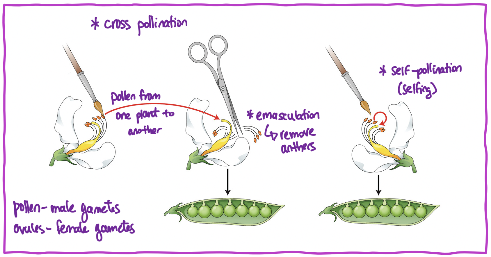{width="70%"}

Now, Mendel decided to create what he called **pure breeding** lines. This meant that every single seed he grew from one pure-breeding individual always had the exact same **phenotype** or set of visible traits. So if he had a pea plant that had purple flowers, and smooth, green seeds, no matter how many times that plant produced seeds those offspring always had purple flowers, and smooth, green seeds. That plant is called pure breeding. Mendel created a few pure breeding lines with different phenotypes. Some had white flowers, some had purple flowers. Some had wrinkled seeds, some had smooth seeds. Some had yellow seeds, some had green seeds. And these pure breeding lines had these traits (or phenotypes) in different combinations.

Here's the fun part. Mendel started crossing the pure breeding lines with other pure breeding lines, and he found something puzzling. Every time he crossed a purple-flowered plant with a white-flowered plant, all the flowers of the offspring were purple. None of them were white. Sort of weird, given this idea of blending inheritance. He noticed the same pattern with the other traits too. When he crossed plants with smooth and wrinkled seeds, all the seeds of the progeny were smooth. And he did this thousands of times, and thousands of offspring from that cross would only have smooth seeds. He called these traits **dominant**---the traits that appeared with 100% frequency when two pure breeding lines were crossed. The traits that seemed to "disappear" he called **recessive**.

Then he decided to cross the **hybrids**---the offspring from the crosses between the pure breeding parents (pure breeding parents are also known as the **parental generation**). When he crossed these purple-flowered hybrids, he suddenly would see white flowers again! Not only did he see them again, but he saw them in consistent ratios! He would consistently recover one white-flowered plant for every three purple-flowered plants, a 3:1 ratio. This absolutely flies in the face of blending inheritance. There is no way that you could _recover_ the recessive phenotype, the one that was absent in the hybrid generation, if it was blended away. Something else was happening.

Now we know what's happening. Blending inheritance is wrong. Traits or phenotypes are coded into discrete entities known as **genes**, which are segments of DNA found on **chromosomes**. In diploid organisms like us, we have two copies of every gene. The different copies of genes that one could have are known as **alleles**. In our example, there is one allele for purple flowers and one allele for white flowers---the gene itself is the "flower color" gene. 

{width="20%"}

So let's think back to that cross between the pure breeding white-flowered and purple-flowered parentals. Another word for pure breeding is **homozygous**. If an individual is homozygous, they have two copies _of the same allele_ for a particular gene. This is important, because when individuals make gametes or sex cells, they only give _one_ allele to the gamete. If they are homozygous, there is only one allele that they can give! So the pure breeding plants each gave the only allele they could give: one dominant allele from the purple-flowered plant, and one recessive allele from the white-flowered plant. This made an entire generation of hybrids, also known as **heterozygous** individuals with one of each allele. They all had the same phenotype, because one allele was dominant to the other! And then when the two heterozygous individuals were crossed, each could give one of _two different_ alleles to their gametes. We represent this in a Punnett square.

So to recap. We look the way we do because of the genes we have, but also because of the specific alleles we have of those particular genes. Human beings are diploid organisms that reproduce sexually. We reproduce with gametes, sperm and eggs. Gametes are haploid and contain only half the genetic information that our bodies contain---so we only contribute _half_ of our DNA to our offspring. Offspring are created when two haploid gametes fuse to create a diploid embryo. We have 46 chromosomes in our cells: 23 of those chromosomes came from our mother's egg, and 23 of those chromosomes came from our father's sperm. Cool. But _how_ is the information actually stored in DNA, and how do we actually use that information to make people?

### The "central dogma" {-}

We have already covered the structure of DNA. You know that there are two strands wound together in a double helix. You also know that the two strands of DNA contain four different nitrogenous bases---A, T, G, C---and that these form hydrogen bonds with the bases in the other strand. DNA is really the storage of information. Our genes are locked inside that DNA in our nucleus, and the DNA never leaves. What happens is that enzymes, working together with RNA, make a _copy_ of the DNA, and that copy travels outside of the nucleus where the protein will actually be assembled. A better way to say this is that DNA stores the information and RNA expresses the information.

{width="65%"}

We will get into the mechanics of this throughout the unit, but we can think about a broad overview now. First, special enzymes open up DNA, basically unwinding the double-helix. This means that the bases on the inside of the DNA are now exposed. Because these bases hydrogen bond with complementarity to other bases, this property makes it possible to generate a copy of the DNA. When we want to make a protein, we use enzymes and RNA to make a copy called **messenger RNA or mRNA**. It's mRNA that travels outside of the nucleus and into the cytoplasm, where ribosomes "read" the mRNA. Another special RNA molecule called **transfer RNA or tRNA** essentially brings over a particular amino acid based on the nitrogenous bases in the mRNA. Bit by bit, amino acids are brought over and a protein is constructed. Pretty cool!

### The special properties of RNA {-}

You'll notice that there's a lot of RNA, doing a lot of stuff. RNA is the copy of DNA that moves around. RNA brings the right amino acids. RNA is really doing a lot of heavy lifting in this process! One of the biggest challenges in understanding how life may have formed is that DNA makes RNA makes proteins---but also proteins are a huge part of this process, working as enzymes to catalyze all these reactions. Remember when we talked about the "closed loop" of life? This is one of the closed-iest loops of all. How can we create genetic information when we need proteins to do so, and how can we create proteins without genetic information?

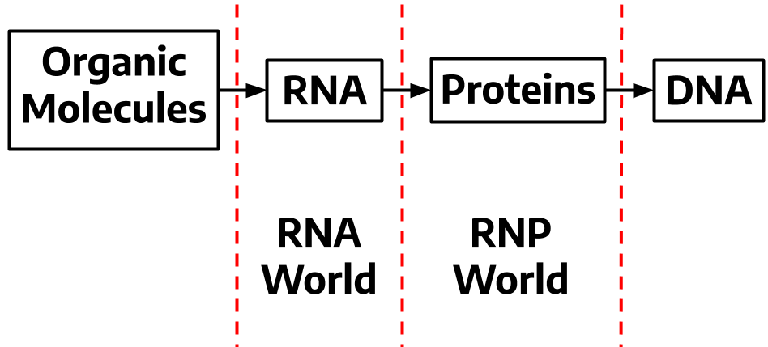{width="40%"}

But here are some interesting facts about RNA. Like DNA, RNA is capable of information storage. Like protein enzymes, some RNA molecules can actually catalyze reactions! In fact, the ribosome, that amazing little machine that facilitates the reading of mRNA to make proteins, is _also_ mostly made of RNA. Many coenzymes contain sections that look like RNA leading many to hypothesize that these are remnants of bound coenzymes in an RNA world. In other words, RNA has a lot of special properties that implicate it in life's origins. So the full hypothesis is that these little RNA replicators and machines were reacting and replicating, before there were proteins, before there was metabolism. And sometime _after_ that, **ribonuclearproteins**, which are molecules that contain proteins and RNA like ribosomes, arose as an intermediate stage. Lastly, the development of modern proteins and the storage of information in DNA. The thing is, RNA is not terribly stable and wouldn't work as information storage for larger or more complex organisms. That's one of the problems, but there are more.

But first. Let's spend a little time learning about the extant mechanisms by which DNA in our bodies replicates and makes the proteins essential to our lives.

## 18: DNA Replication {-}

Much like our discovery of cells, the discovery of DNA took some time. You may have heard a bunch about Watson and Crick. Frankly, these two are essentially an afterthought in the long process of discovering DNA and what it does inside living organisms. Did they discover DNA? No. That was a Swiss guy in 1869. (Yes, Miescher did it by going around to local hospitals and collecting used bandages to study. Gross, dude.) Did they discover that DNA contained genetic information? Nope, not that either. A trio of folks did that in the Avery–MacLeod–McCarty experiment. Did they take the famous photo that led to the discovery of the structure of DNA? Well, no, they didn't do that either. Well jeez, were they even the first to figure out the _significance_ of the photo that led to the discovery of the structure of DNA? They didn't do that either! They essentially stole the data from someone else and published it over her head. She died of cancer before these two clowns were awarded the Nobel Prize for "their" discovery.

{width="40%"}

Her name was Rosalind Franklin. History might have erased her, although her name is becoming more prevalent in recent years. She took the photograph, she correctly identified its significance, and her work was shared with Watson and Crick without her knowledge. The many years she spent working with X-ray diffraction imagery is also likely what led to her early death from cancer. If you can't tell, I'm not a fan of Watson or Crick. Not only for the (sadly common practice) of erasing the contributions of women (and other systematically excluded groups) in science, but James Watson also has a [really long history](https://www.vox.com/2019/1/15/18182530/james-watson-racist) of saying incredibly racist and sexist stuff, including, in particular, about Rosalind Franklin. But it's not just that.

I'm not especially keen on anyone "owning" their contributions to science, for two reasons. The first is that I think knowledge belongs to all of us, regardless of who happens to discover it first. Big problems are usually tackled by many people at many institutions, usually over decades or more. This means that luck has a big role in whoever was "first" to get there. If that person didn't discover it, someone else would have. This also means that it's never one individual entirely responsible for a great discovery. Even Charles Darwin based his ideas off of Thomas Malthus, Charles Lyell, and his own grandfather, Erasmus Darwin, among others. We build our ideas together. And more than that, these ideas are larger than any one of us, impossible to generate completely alone. 

And the second reason is that for centuries, only certain people were afforded the privilege that made it possible to perform scientific research in the first place. There are many great minds that we have never heard of, because they were too busy being subjugated and oppressed to play with microscopes or spend long hours tinkering in their notebooks. Many were not afforded a formal education at all. So you may notice that I don't spend a lot of time saying "this person discovered this" or "that person discovered this other thing." I hope for the pursuit of knowledge to be a selfless one aimed at contributing to the greater good rather than the fame of an especially lucky individual.

But I digress.

### How it works {-}

One of the first requirements of the transfer of heritable information is that it must be easily copied. And it can't be a janky copy either; it must be a really, really excellent copy, also called a high-fidelity copy. Your cells don't last forever, not any of them. So what keeps you living and growing is that those cells make copies. Your skin sheds, your hair grows, you get cut while you're cooking dinner---all that stuff requires more cells, and every time a cell gets made, DNA must be copied. Can you imagine if DNA was copied poorly like a copy machine from 1995? Too many mistakes and our cells would simply begin to fall apart.

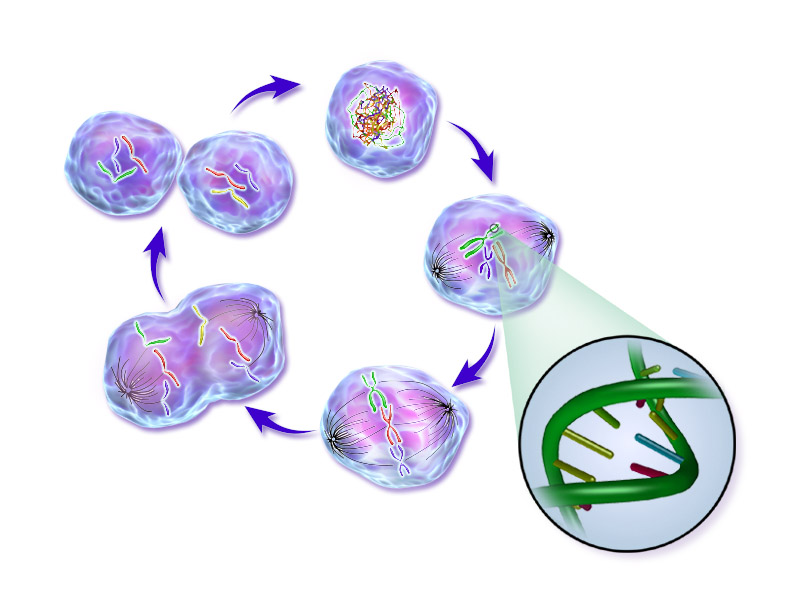{width="50%"}

We already know how much DNA there is in our bodies. Like, a lot. And our entire genome exists pretty much in every cell in our bodies. So not only must DNA be copied, it must be copied _fast_. And it is, in fact, copied very fast. First, we'll talk about how the structure of DNA lends itself to copying. Next, we'll talk about the process of copying and the enzymes that make it possible. You didn't think we could do this without our favorite little machines, did you?

We know that because of the structure of nucleic acids, they have a specific directionality. The 5' end of one can only be added to the 3' "butt" of the other. We know that DNA is made of two strands, wound together in a double-helix, running antiparallel to each other. An we know that across these strands, A binds with T and G binds with C. So let's take that knowledge for a spin.

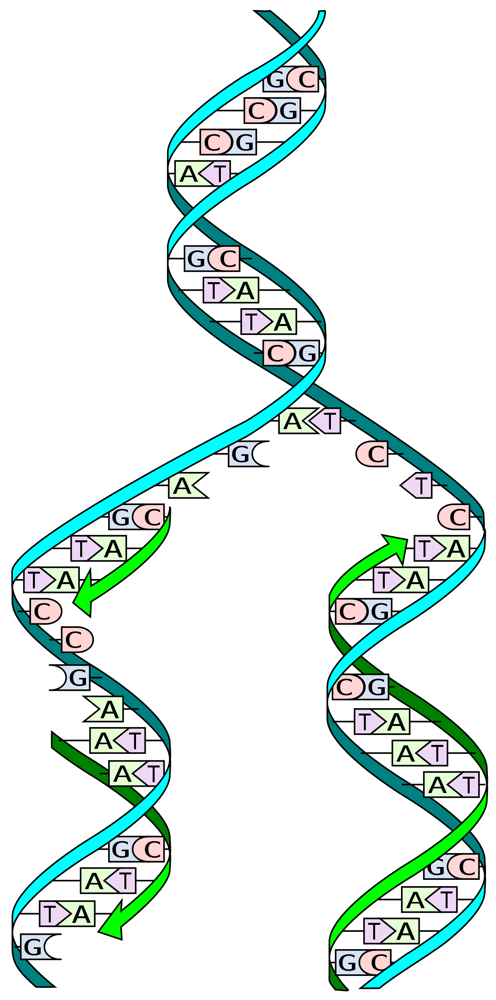{width="20%"}

To replicate DNA, it is first unwound so that the two complementary strands are "opened" up. Each strand serves as a template to create its complementary strand. In the two new DNA molecules, one strand is old and the other is newly synthesized. We call this **semiconservative replication**, because we always keep one old strand and synthesize one new strand. The structure of nucleotides means that it's really difficult to put an A where a G belongs.

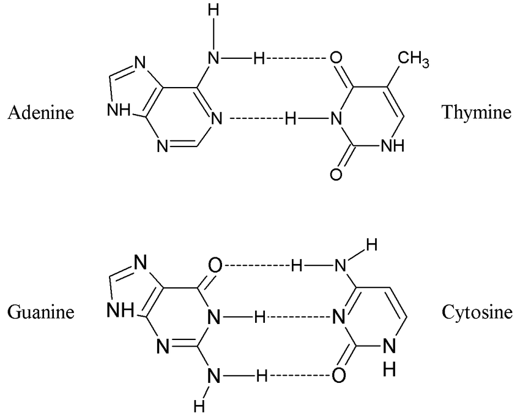{width="50%"}

Okay, okay, we get it. DNA unwinds and then the two strands serve as templates for the new strand. Wait, but how does this actually happen? How is DNA unwound and how do the new nucleotides get there? Enzymes, of course! So let's go through the process step-by-step and get acquainted with the key players.

1. **Helicase**. This enzyme "unzips" the DNA and breaks the hydrogen bonds between the existing nucleotides.
2. **DNA polymerase**. This is the enzyme that actually synthesizes the new strand by attaching the complementary nucleotides to the right place.
3. **Primase**. DNA polymerase needs a starting point---it can't just start synthesizing without something to hook onto, so a small "primer" is added at the beginning to get it going.
4. **DNA ligase**. This special enzyme joins DNA fragments together. Why would you need to join DNA fragments together? Well, it's complicated, and we'll dive into that next.

Remember that DNA strands run antiparallel. That means one strand is running in the 5'--3' direction, and the other in the 3'--5' direction. So far so good. But also recall that new nucleotides can only be added in one direction, because the 5' end of one _must_ attach to the 3' end of the other. So _synthesis_ can only occur from 5' to 3'. This means that the **leading strand**, the strand running in the 3'--5' direction, is all good because its complement will be synthesized antiparallel in the 5'--3' direction. DNA polymerases attaches to one primer and just lets it rip! But the other strand, the **lagging strand** has a problem, because it runs in the 5'--3' direction. So it essentially needs to be synthesized... backwards.

{width="80%"}

What happens is that DNA polymerase does this in short chunks called **Okazaki fragments**. A primer is added, it synthesizes a little chunk, and then another primer is added, it synthesizes the next chunk, and so on. Then DNA ligase comes along and **anneals** or glues the fragments together. Frankly, it's a really big pain!

Now, this process is, as always, a bit more complicated than what we'll cover together in class. We won't discuss all the nifty ways that DNA polymerases can proofread and correct mistakes. But it is important that you generally understand how this process works, because it will become relevant again when we discuss asexual reproduction and especially when we discuss meiosis. But first we'll work on understanding how this DNA is actually used to construct proteins and whole organisms.

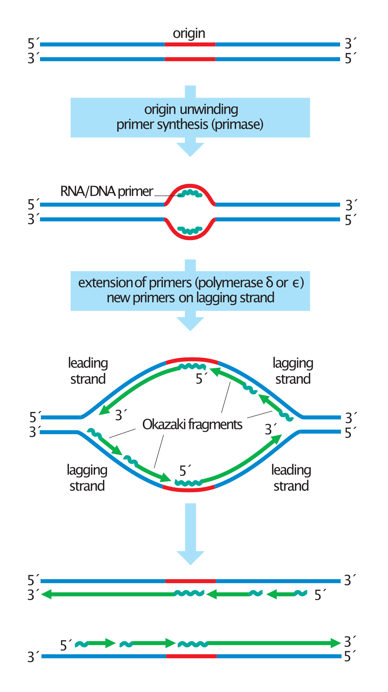{width="55%"}

Also check out this [YouTube video](https://www.youtube.com/watch?v=TNKWgcFPHqw) to see this process visually!

## 19: Transcription {-}

Copying DNA is important because all mitotic cells at some point need to copy their DNA. But DNA doesn't really _exist_ for copying, so to speak. It's main job is housing genetic instructions; those instructions code for proteins (and sometimes other stuff!), and proteins do the work of life. The fact that DNA encodes heritable information allows life to establish itself---first, by retaining methods of energy capture or the construction of organelles from generation to generation, but also because once something is there it can be built upon in subsequent generations. Let's imagine that you have a recipe for a simple cake. Some of the ingredients you won't be able to change or substitute, like it would be pretty hard to make a cake without any flour. We might say that "flour" in this case is highly conserved. But maybe you add vanilla extract one time, or substitute cinnamon in place of kosher salt. A lot of times the cake will be mostly the same, or maybe taste kind of gross. But sometimes you might figure out something that tastes pretty good, and you'll keep using it.

{width="50%"}

This analogy is okay, but there is one major flaw. In a recipe you can change anything you like---you can make big, drastic changes. You could just go ahead and make a pie instead. But DNA doesn't work like that, although it helps to think of DNA kind of like a recipe or template. Mutations can occur that alter the DNA sequence, but you never end up with an entirely _new_ DNA sequence built from scratch. It's not possible, given how DNA replication and meiosis (next unit!) work. And the bigger the change, the higher likelihood that the organism cannot survive. Sometimes there do occur big mutations, or small mutations with big effects. But there are constraints, given the currently-existing template.

We will get into this more in the next unit, but to understand it better, we need to understand how DNA is used to actually construct an organism. There are two pieces to this process, the first being **transcription**. This is when DNA is used as a template to create an mRNA copy called a **transcript**. The next part, **translation**, is the mRNA copy is used to construct the sequence of amino acids that will make up the protein. This is part of the central dogma, where the flow of information goes from DNA to RNA to protein (amino acids). 

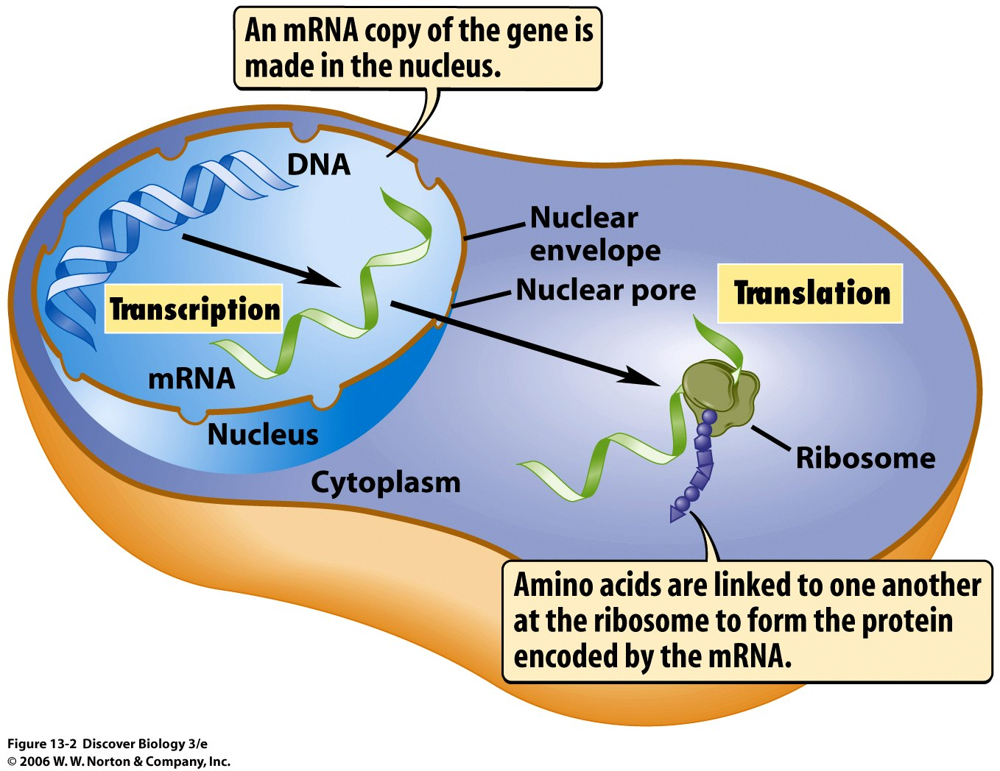{width="50%"}

### Gene regulation {-}

You know that your entire genome exists in the nucleus of most of your cells, tightly wrapped up around histones. But have you ever wondered how each cell knows which proteins to make? How does a toe cell know how to make toe proteins and a heart cell knows how to make heart proteins? Not only that, you can imagine that proteins need to be created at specific times, or that an environmental response may require different _amounts_ of specific proteins. Of course, \#itscomplicated. But we will cover some simple ideas related to how this works, in general known as **gene regulation**. (I'm focusing here on eukaryotes, mostly because we are eukaryotes, so it seems relevant to us.) It makes sense that genes can be regulated by controlling whether or not mRNA transcripts are made in the first place. Genes may also be regulated once the transcript has been already beem made. So there are two broad categories of regulation: **transcriptional gene regulation** and **post-transcriptional gene regulation**. Here we will mostly focus on the first one.

Multicellular eukaryotic organisms have, on average, about 25,000 genes, which is approximately seven-fold more than the average prokaryote. This means that gene regulation in eukaryotes is very complex. Some genes are only transcribed in the event of a viral infection. Some genes are transcribed all the time, at varying levels. Some genes are only active during certain stages of development. And generally speaking, most genes are usually turned off. So gene regulation must ensure that the majority of genes are off while still maintaining the ability to activate very specific genes under very specific conditions---really, thousands of patterns of gene expression are and must be possible. Another challenge in eukaryotic genomes is that the genes are very far apart. You'd think this wouldn't be the case, given how many more genes we possess, but we also have a lot of DNA that doesn't code for proteins (called **non-coding DNA**). In _E. coli_ there is about one gene for every 1400 bases, but in humans, there is only one gene for for every 100,000 bases.

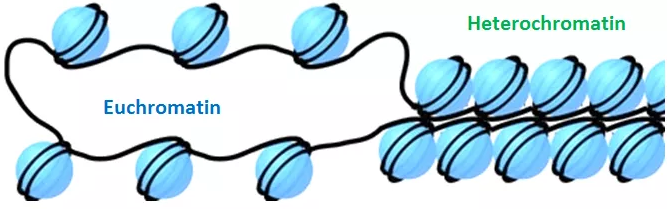{width="50%"}

The first and most basic way that genes are regulated is that there are tightly wound around histones so nothing can get to them. In order to make an mRNA copy, a bunch of transcription machinery needs to access the gene, which is not possible when the gene is tightly tucked away. Broadly, there are two types of chromatin: **heterochromatin** which is very densely packed, and **euchromatin**, which is more loosely packed and more easily accessed. These chromatin states are actually fairly stable and can actually themselves be inherited by daughter cells after mitosis. Because chromatin states can be inherited but are not directly part of the DNA sequence, this is a form of **epigenetic regulation**. So first and foremost, the gene can simply be "off" because it is tightly packed in heterochromatin.


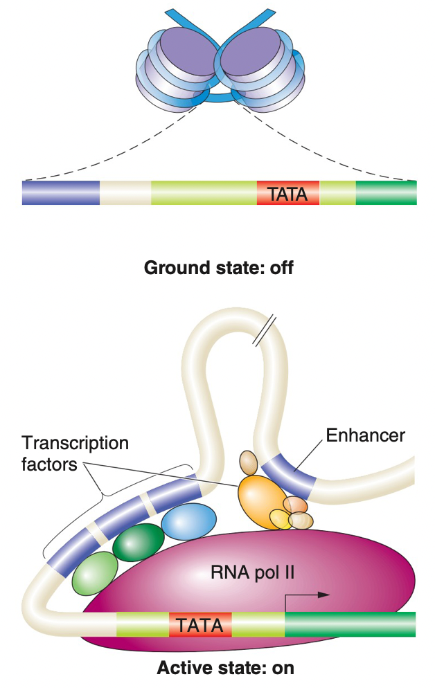{width="30%"}

Next, we have regulatory proteins and regulatory DNA sequences that must work together to activate transcription. There are a few key players here:

+ **RNA polymerases.** There are actually three kinds of RNA polymerases, but we'll focus on RNA polymerase II. This enzyme is responsible for generating the mRNA by attaching complementary RNA nucleotides to the DNA template strand that codes for the gene.
+ **Transcription factors**. These are proteins that bind to specific sequences on the DNA and will ultimately attract RNA polymerase II to the correct location to begin transcription.
+ **Enhancers**. These are DNA sequences that are often located a considerable distance away from the gene that will be transcribed. Transcription factors will also bind enhancers to intitiate or regulate transcription.


### Making and processing mRNA {-}

What happens broadly is that DNA is unwound and strands are separated, and transcription factors bind to the **promotor sequence** which is upstream from the gene being transcribed. Transcription factors may also bind enhancers and ultimately form a complex with RNA polymerase II to initiate transcription. Just like in DNA replication, the transcript is synthesized by adding complementary nucleotides until RNA polymerase recognizes a special sequence that acts as a signal to terminate transcription. Once the transcript is generated, it often must be "processed" before being read by ribosomes. Ribosomes "read" the mRNA by their nucleotide sequences.

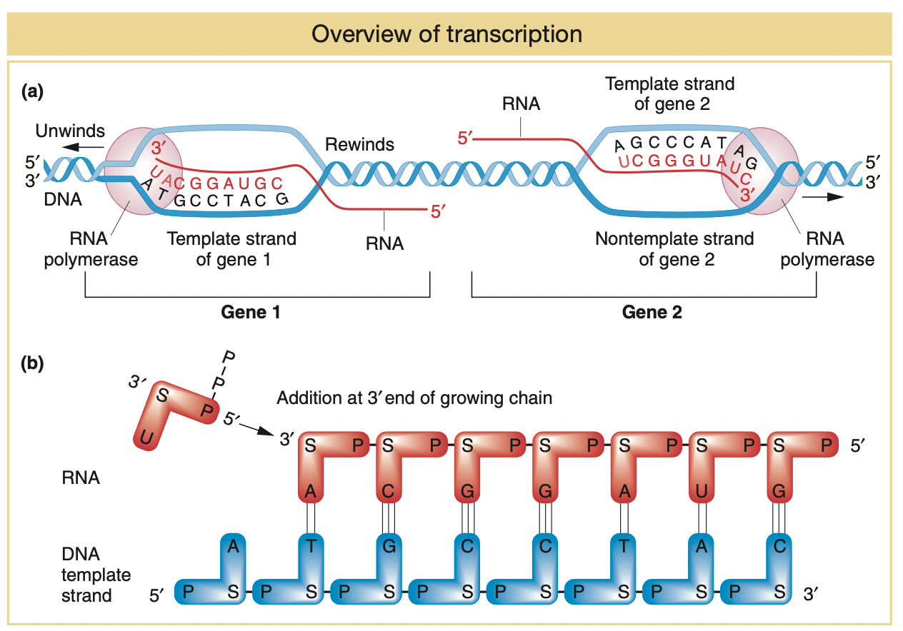{width="70%"}

We call the strand of DNA that generates the mRNA the **template strand**. I know what I'm about to write sounds weird, but we _also_ call the template strand the **non-coding strand**. Huh? Well, we call the _opposite_ strand the **coding strand** because it matches the mRNA transcript (except its DNA, so it has T instead of U). So the strand upon which the mRNA is generated is the template, non-coding strand. The opposite strand, which will essentially match the mRNA, is called the coding, non-template strand. Le sigh. But remember that the DNA strands are complementary and thus have a different sequence of nucleotides! So a specific protein can only be coded for by one strand, because the other strand would make a totally different protein. Maybe it's possible that one strand makes one protein, and the other strand makes a different one, as in the figure above.

Of course, there are different players in DNA replication and transcription, but the process is remarkably similar. The main thing to remember is that RNA polymerase adds uracil (U) instead of thymine (T), because mRNA is, obviously, made of RNA. So if the template non-coding strand reads 5'--ATTG--3', the mRNA transcript would read 5'--CAAU--3'. _Whoa, that doesn't look right!_, you say. Why is it not UAAC? It's very important to keep your eye on the directionality of DNA and RNA. The convention is always to write the 5' end first and the 3' end last. So technically the complemetary strand to 5'--ATTG--3' is 3'--UAAC--5', but we flip it so that the 5' appears first. This is tricky so try and practice this a few times with some random sequences!

Once the mRNA is made and transcription is terminated, the mRNA transcript gets processed. We won't cover too much detail about this in class, just know that some enzymes---what else!---prepare the mRNA to be translated into protein. The most interesting part eukaryotic genes have **introns** and **exons**. Pieces of mRNA that will actually encode proteins are called exons, while introns are pieces that generally removed by splicing machinery before the transcript is complete. Why have parts of a gene that need to be removed? Because maybe the protein has different variations based on which cell type its in! One gene can in fact code for multiple proteins by a phenomenon known as **alternate splicing**, where different mRNA transcripts can be made with different combinations of exons. Whoa.

{width="60%"}

Once the mRNA is capped and spliced its ready to be sent out of the nucleus into the cytoplasm. There, the mRNA will meet a ribosome that will "read" it and construct the sequence of amino acids that ultimately make the protein. This process can be difficult to conceptualize in your head, so check out this [YouTube animation](https://www.youtube.com/watch?v=_Zyb8bpGMR0) to get a sense of how this works in 3D space. This video has slightly more detail than you need about mRNA processing, but the animations should really help.

Stay tuned for more on this process of translation!

\newpage

## 20: Translation {-}

Okay, so we transcribed the code in DNA to mRNA, and mRNA traveled to the cytoplasm. Now the mRNA must be "read" somehow so that a protein can be constructed. First lets do a tiny bit of review on proteins and their general construction before we dive into how this process works.

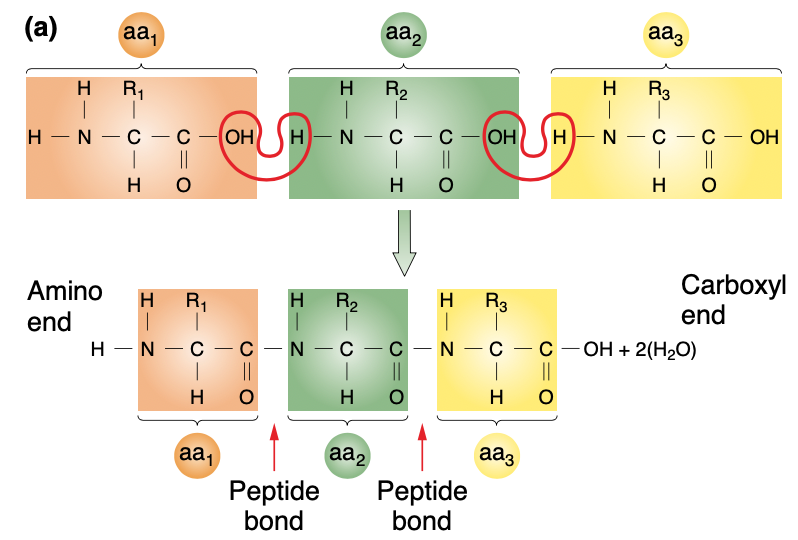{width="60%"}

The primary structure of a protein is its linear sequence of amino acids. There are twenty amino acids, which make up all the proteins in every organism on Earth. In every amino acid is an amino group on one end (N-terminus) and a carboxyl group on the other (C-terminus), and these link together through a **dehydration reaction** where the OH of the carboxyl and the H of the amino are removed as water and a peptide bond is formed. Remember that every amino acid also has a distinct R group or side chain that gives it unique properties.

So somehow we need to go from the sequence of nucleotides in mRNA to specific amino acids. First, we'll discuss how the nucleotides "code" for specific amino acids. Next, we'll discuss what happens in the ribosome to create the primary structure of the protein. Once the primary structure is complete, many proteins must then be "processed" before taking their final shape. We won't get too much into that process here, but we'll briefly review some of the ways this happens.

### The genetic code {-}

We know that mRNA is constructed of a sequence of nucleotides, and that somehow those nucleotides "code" for different amino acids. Now for the big reveal! If nucleotides can be thought of as "letters," then we can think of the code for amino acids as the "words." Every word is three letters long. Which is to say that one **codon**, the collection of nucleotides that codes for a particular amino acid, is three bases long. This means that the genetic code is read in triplets. So let's say this is our original mRNA sequence: 5'--AUGGGCATAUGA--3'. We split this into triplet codons: AUG, GGC, ATA, UGA. This sequence of mRNA codes for a polypeptide that is three amino acids long. Wait, what? There are four codons!

All mRNA transcripts end with what we call a "stop" codon which terminates the process. And, mRNA transcripts start with a specific amino acid, called methionine, so they typically have the same "start" codon, too! What's cool is that we cracked the code, so to speak, so we know what amino acids each triplet codon represents (there are some exceptions, of course, because biology!). Basically we did this by creating mRNA sequences that were just one amino acid, for instance, a bunch of uracil in a row (polyuracil). Turns out, UUU codes for phenylalanine. And so on, until we learned that there are 64 triplet codons that all code for certain amino acids (except the stop codon!).

That's sort of weird though, because we only need twenty codons for twenty amino acids. Obviously having 64 codons means that there are duplicates. For instance, CCU, CCC, CCA, and CCG _all_ code for proline. Thus we say that the genetic code is **degenerate**, meaning that all 64 codons represent something specific. Imagine that there are 64 possibilities (mathematically there are, given four different nucleotides in triplet combinations) but only twenty of those actually code for something and the rest are gibberish. This could seriously mess up protein construction if there were a mutation! Thinking back to proline, if that third base became mutated _it doesn't matter_ because CC[any base] will still code for proline. (This is called a silent mutation because the DNA changed but the protein it codes for did not.) A degenerate code thus has multiple pieces that code for the same thing.

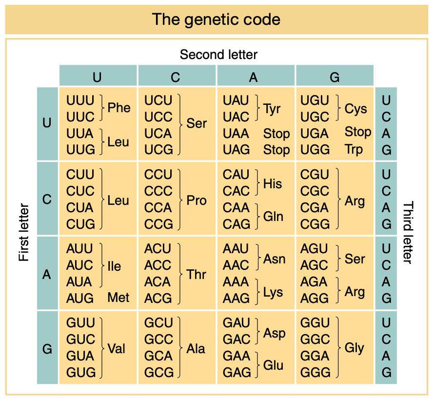{width="60%"}

Because the genetic code is read in triplet codons, adding or removing one base (really, adding or removing anything other than three bases!) can cause serious changes to the resulting protein. Let's use the following as an analogy:

<center>
THE FAT CAT ATE THE BIG RAT
</center>

What happens if we remove one of the letters, but keep the **reading frame** the same---as in, we still read three letters at a time? We'll take the "C" from CAT and see what happens. We call this a **deletion**:

<center>
THE FAT ATA TET HEB IGR AT
</center>

Yikes. It's also bad if there is an **insertion**, where an additional base is added. We'll add another "C" in front of CAT:

<center>
THE FAT CCA TAT ETH EBI GRA T
</center>

This kind of mutation---insertion or deletion---can cause a **frameshift** resulting in downstream chaos. (Unless three bases are added or deleted, meaning that the reading frame stays the same.) What typically happens is the frameshift causes a premature stop codon to appear and the protein is truncated too early. But remember that amino acids all have different properties, so bringing the wrong amino acid means that the protein is very likely to be malfunctioning.

### Making the primary protein sequence {-}

The genetic code consists of codons that are read three bases at a time. But how? I think this part is pretty cool. Another molecule called **transfer RNA or tRNA**. Big surprise, tRNA is made out of RNA. This makes a lot of sense, because something needs to "read" the mRNA---and what better than complementary RNA bases? The structure of tRNA is a kind of loop, where on one end is an **anticodon**. If the sequence of mRNA reads "AUG," then the anticodon reads its complement, "UTC." Attached to the other end of tRNA is the correct amino acid. 

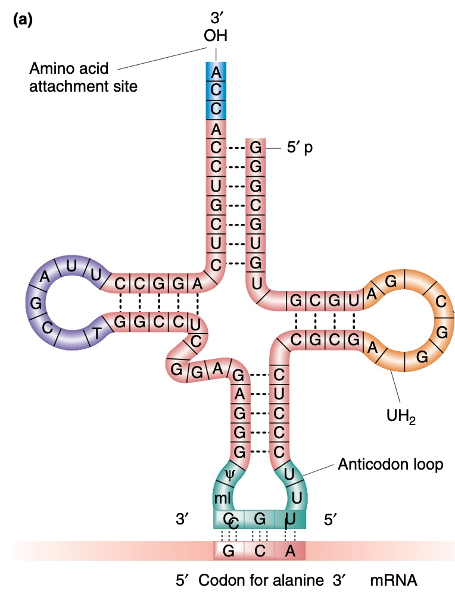{width="30%"}

To begin making a protein, we need the mRNA, tRNA, and a ribosome. Some special proteins assemble at the 5' end of the mRNA transcript, and scan it, looking for AUG. The start codon is usually AUG, or methionine. Once AUG is located this triggers the assembly of the complete ribosome, which consists of a large and small subunit. The helper proteins fall away and the ribosome can get to reading! 

There are three "sites" in the ribosome, called E, P, and A. The A site is where the "special" tRNA binds---special, because it is attached to an amino acid (techncially it is called aminoacyl-tRNA). As the ribosome moves, enzymes catalyze the formation of a peptide bond between this amino acid and the growing chain of amino acids that are located in the P site (I remember P for Protein). Once the tRNA molecule releases its amino acid to the growing chain, it exits the ribosome, from the E site. This is really hard to imagine in your head, so I highly recommend watching a YouTube video [like this one](https://www.youtube.com/watch?v=5bLEDd-PSTQ). 

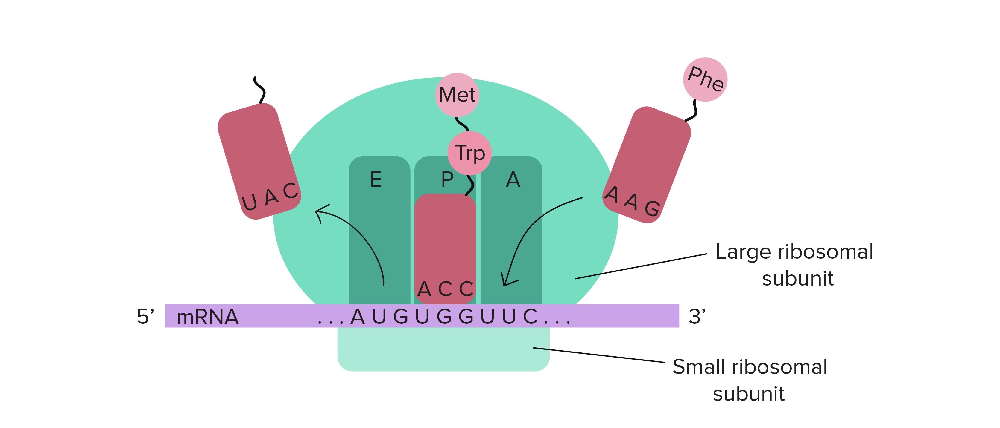{width="60%"}

The ribosome goes along the mRNA, with tRNA bringing amino acids, until a stop codon is reached. The stop codon does not bind any tRNA, it binds a special protein called a **release factor**. This triggers the release of the ribosome from the mRNA. And, now we have our primary protein structure---the linear sequence of amino acids! From there, some protein processing may be necessary. Some proteins spontaneously fold into structures on their own based on the arrangement of their R groups. And, some proteins need a little help folding so there are other proteins that assist them. There is also something called posttranslational modification, where the side chains are modified or altered after the protein is made. Obviously proteins do all kinds of things, so proteins must have many different properties to accomplish their specific tasks!

As you now can see, the process of going from DNA to protein requires a good deal of synthesis---and doing that requires enzymes. How could we possibly make a long chain of mRNA without RNA polymerase to catalyze this reaction, or helicase to unzip the DNA, or transcription factors to guide RNA polymerase to the right place? And where do we actually get the supply of nucleotides or amino acids from in the first place? (Some of it we can synthesize ourselves, but a lot of it we get from food.) The point is, the entire processes is completely dependent on proteins. And yet. DNA codes for proteins. Instead of asking ourselves about the chicken or the egg---the amniotic egg predates the chicken by lots of millions of years!---we should probably ask, _Which came first, RNA or protein?_

## 21: Why RNA first? {-}

This is the point in the class where we can truly take some knowledge for a spin. (How many times have I said that this quarter? Jeez.) We now know a lot about the key aspects necessary for the maintenance of living organisms. Not just us humans, but all living organisms. We've learned about the lipid world and the catabolic world, but today we'll examine what I expect is the most famous and (maybe) best-supported hypothesis: the RNA world. There are a lot of good reasons to like this hypothesis, and there are also some interesting implications if its true. But of course, this hypothesis not without its problems (biology, amirite?!). Another way to say this is that the properties of RNA lend itself to this hypothesis being _plausible_. Does that mean it actually happened this way? Obviously not. But since so many hypotheses surrounding life's origins are essentially statistically impossible, being plausible is a good first step.

As we learned this unit, the systems of metabolism, reproduction, and in large part, organization, require three types of molecules: DNA, RNA, and protein. These three components are so dependent on each other that it becomes difficult to investigate origins. The RNA world is attractive because RNA molecules have the ability to do jobs related to _both_ information storage and catalytic activity. The major finding that opened this line of inquiry was the discovery in 1982 of molecules called **ribozymes**. These are molecules made of RNA that are capable of acting as enzymes, or in other words, catalyzing reactions. Before this discovery, it was largely accepted that only proteins were able catalyze reactions.

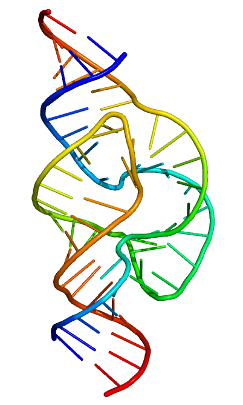{width="20%"}

What's especially interesting about ribozymes is that the reactions they catalyze have to do with breaking apart and putting together DNA, RNA, and amino acids. Sounds familiar, if I do say so myself. Scientists have even been able to construct autocatalytic (self-replicating) ribozymes in laboratory conditions. Of course, just because scientists are capable of creating such a molecule says nothing about whether or not life originated that way. But like many things in science, we gain from the expansion of our knowledge, even if we don't always know exactly where that exploration will lead. Demonstrating possibilities helps us understand scenarios that could facilitate the emergence of life. Will we ever _really_ know exactly how it happened? Honestly, probably not. (Although I would never say never! copyright Justin Bieber) Life has had billions of years to evolve beyond something recognizable as the "first life form," and the specifics are likely lost to time. Even still, after millennia of sharing and developing creation stories, I imagine we are closer now than ever before.

### What RNA brings to life and what it misses {-}

Time for a little imagining. We understand the mechanics of DNA replication and transcription. We know that the complementarity of nitrogenous bases provides a means of making high-fidelity copies. We really can't stick a thymine where a guanine should go. An really, for this whole thing to work, you need two kinds of bonds. You need the strong bonds between the nucleotides of one chain, like the phosphate-sugar backbone. But you also need weak, reversible bonds, like the hydrogen bonds between nucleotides. Obviously, both RNA and DNA are capable of such bonds. So if we have available nucleotides, and molecules capable of catalyzing polymerization---making a chain of those nucleotides---then we can have these RNA replicators. 

Let me start with the problem. And it's a giant, gaping, huge problem in this theory. In order to make long chains of nucleotides (known as polynucleotides), you need a bunch of nucleotides sitting around. (Kind of a duh.) Not only that, but these nucleotides must be **activated nucleotides**. We won't get too much into the chemistry behind this, but suffice it to say that not any nucleotide will do; such nucleotides need chemical modifications for replication to proceed. Essentially, you need a giant pool of activated nucleotides sitting around. But the rub is that these are _highly_ unlikely to have originated spontaneously. (Yet another thing proteins do, sob.) And even if they did, the odds that there would be thousands or millions of them---enough to sustain the evolution of these little replicators---are practically zero. And what's worse, in order to actually trigger catalytic activity of RNA, we need an actual molecule of RNA, a polymer of some length. But I say _again_: how can we make an RNA polymer without any enzymes, in the absence of proteins?

{width="50%"}

Recent work shows that minor alterations to tRNA can impart an ability to autonomously replicate. Which is to say that this hypothesis still seems promising, despite the drawbacks. RNA replicators free us from many of the constrains of our earlier hypotheses, because RNA replicators don't actually make proteins; they don't even necessarily exist within organized structures like protocells. They are simply "doing chemistry" by replicating and adding nucleotides in a primordial soup. The biochemistry that serves to make proteins could essentially build _around_ the replicators over time. As we know, many aspects of protein synthesis revolve around RNA, including the transfer of information from DNA and the bringing of appropriate nucleotides to the ribosome. Even the ribosome itself is made partly of RNA! So we have these little RNA "machines," replicating and catalyzing their replication. Over time, with sustained interaction and the chemistry of say, hydrothermal vents, RNA may start interacting with amino acids. This interaction, at first, may not produce much of anything. But at the moment it produce _anything_ that provides an advantage for the replicator, that replicator would out-replicate all the other replicators. 

This to me gets at the most interesting implication of the RNA world hypothesis. If information storage came first, then evolution by natural selection has been operating on living organisms since the very beginning---actually, since before life _really_ began. But, if the protocell or encapsulation hypothesis is correct, evolution by natural selection could not act until protocell components were stored as heritable information. I've hinted at this idea for awhile now, but today we understand enough about biology to really dive into it.

### Descent with modification {-}

What actually is evolution? The simplest definition of **evolution** is that it is descent with modification. (I also previously defined this as the change in heritable characteristics of a population over time, which is also true.) What is being modified? The genetic makeup of the resulting organism. Despite these seemingly-simple definitions, evolution can get really hairy and complicated really quickly. That's because, as we've learned, living organisms are complicated and the methods we use to store, transfer, and express genetic information are also complicated. 

Sometimes its helpful to think of evolution as a particular kind of algorithm. An **algorithm** is essentially a very specific set of instructions for solving a particular problem. Here is an algorithm that I ripped off from [Wikipedia](https://en.wikipedia.org/wiki/Algorithm#Examples) called "Find the Largest Number" (actually, it is called "Algorithm Example" but that kind of sucks). Anyway, here is the algorithm in plain English:

1. If there are no numbers in the set then there is no highest number. (Duh doy.)
2. Assume the first number in the set is the largest number in the set. (I take the first one, and I say, _You are the largest!_)
3. For each remaining number in the set: if this number is larger than the current largest number, consider this number to be the largest number in the set. (I compare my largest number to the next one in the set, one by one.)
4. When there are no numbers left in the set to iterate over, whatever is left is the largest number. (The final largest number I had is the largest one.)

Let's put our algorithm into some computer terms and take it for a spin.

```{r, echo=TRUE, include=TRUE}

## Here is a dataframe with a random 
## collection of numbers to check
df1 <- c(3, 45, 6, 4, 100, 12)


largest.algorithm <- function(mydf){
  
  ## First, we find the length of our set
  ## If the length is 0, there is no 
  ## highest number!

  l <- length(mydf)
  if(l == 0){
    print("no highest number, fail")
    
  ## If the length is greater than 0,
  ## we loop through the numbers. We store
  ## the first number, and check if the next
  ## is greater. If it is, we replace our stored
  ## number with the new largest. We iterate 
  ## through the set
  
  }else{
    b <- mydf[1]
    for(x in 2:l){
      if(mydf[x] > b){
        b <- mydf[x]
      }
    }
   b
  }
}

largest.algorithm(mydf = df1)

## Let's check a few scenarios:
df2 <- c(13, 2, 5, 6, 1)
df3 <- c()
df4 <- c(100000, 2000000, 30, 4003200303)

largest.algorithm(mydf = df2)
largest.algorithm(mydf = df3)
largest.algorithm(mydf = df4)

```

If the algorithm is working properly, it should yield predictable results based on the rules of its construction. Evolution is also like an algorithm because there are very specific rules and constraints. Genetic information is coded in discrete units, and there are specific ways such discrete units are inherited. We can actually learn a lot about the process of evolution through computational simulations! That's because the rules of the algorithm can be expressed mathematically. 

What happens over generations is the result of two different kinds of processes occurring on the backdrop of inheritance. We can see that inheritance works in a very particular way, and we'll learn a lot more about that next unit. But because it works in this way, there are two main "forces" governing evolutionary change. The first one we've discussed, called **natural selection**. This is the process that results in adaptations. Essentially, there is genetic variation among organisms that interbreed---that is, every individual is not exactly the same genetically. And some individuals are better able to survive and reproduce than others, because of the genes they possess. So those individuals leave more offspring over time, and that eventually changes the genetic makeup of the entire interbreeding population. We say that those individuals that better survive and reproduce relative to others have higher **biological fitness**. This has nothing to do with how physically strong an organism is---all it means is that this organism survives and produces more offspring relative to others in the population.

But there is another process occurring, one that has nothing to do how well an organism survives or reproduces. This force does not necessarily result in adaptive change. This is the force of chance. First let me explain with an example: imagine that I have a coin and I flip it ten times. How many heads do you expect me to get? Well, there is a 50% chance of heads and a 50% chance of tails. So I multiply 10 by 50% and I get 5. I expect 5 heads.

Great! But how many heads _will I actually get_? Who tf knows! I might get five, that would be cool. I could also get four. Maybe three. MAYBE EVEN TWO, and you might say, huh, that's weird. But it's not all that weird. What would be weird is if I flipped my count a _hundred_ times and I still got two. Then you might say my coin is messed up. In fact, the more times I flip my coin, the closer I'll be to my expectation of 50%. We can demonstrate this too with a computer simulation:

```{r echo=TRUE, include=TRUE}

coin.flip <- function(n){
  
    ## Here, I randomly generate values
    ## of 0 and 1 (as many "n" as I want) 
    ## with a probability of 50%, 
    ## just like a coin
    flips <- rbinom(n = n, 
                    size = 1, prob = 0.5)
    
    ## Here, I assign 1 as heads and 0
    ## as tails
    outcome <- ifelse(flips == 1, 
                      yes = "Heads", no = "Tails")
  
    ## I return my results!
    return(table(outcome))
  
}
coin.flip(n = 5)
coin.flip(n = 10)
coin.flip(n = 1000)
coin.flip(n = 1000000)

```

The same thing happens with inheritance. Remember how we have two alleles for every gene, but only one allele gets inherited by our offspring? That is basically a coin flip! So sometimes we will deviate from our mathematical expectations because of the randomness that occurs when we sample finite (not infinite) values. In evolution, we call this **genetic drift**. It's a dumb name, because it has nothing to do with genes drifting at all. It has everything to do with changes in allele frequencies between generations that are due _only_ to the chance of sampling.

If RNA came first, then the algorithm predates living organisms. Essentially, life was built _around_ the algorithm, the algorithm did not emerge from life. That's really crazy to think about. And in the next unit, we're going to think about it a lot more as we examine the process of reproduction and how this process, over time, lead to the diversity of organisms that we observe today on Earth. Just from that one first cell.

[^13]: find molecular biologist's dream citation