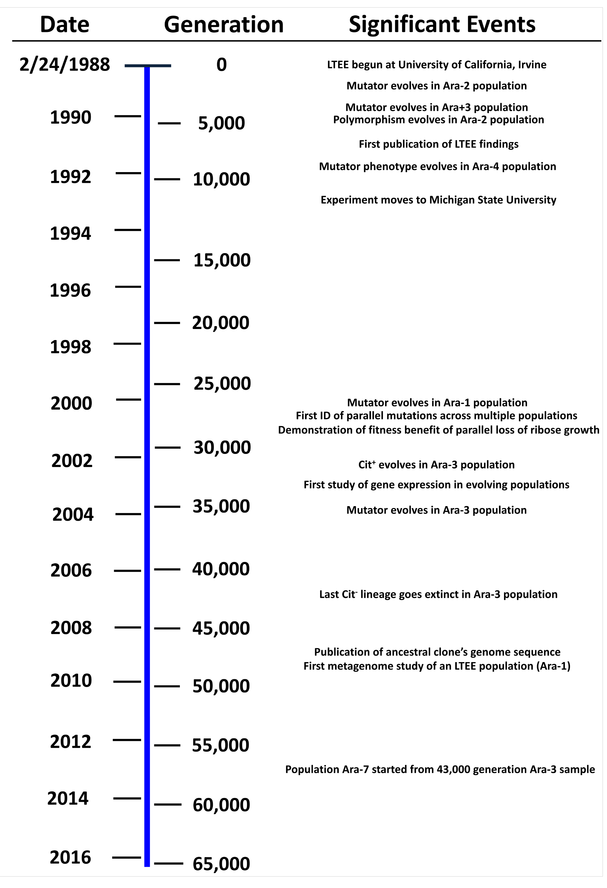

# Reproduction

>All that you touch, you change  
All that you change, changes you  
The only lasting truth is change  
_Octavia E. Butler, Parable of the Sower_

\vspace{6mm}

[[**ACCESS UNIT 5 LECTURE MATERIALS**](https://drive.google.com/drive/folders/1MyVpwwK9F5blGaiYAfVk3l-DPIlIqk8r?usp=sharing)]

\vspace{3mm}

## 22: Asexual Reproduction and Mitosis {-}

Most of us have heard about the "birds and the bees" by now. (I hope!) Which is to say that we understand broadly how sexual reproduction works. Human children learn about this concept at a fairly young age, because we ask questions about where we come from and why we have certain parts that other children (or one of our parents!) don't. We know that sexual reproduction requires gametes from two different individuals that each contribute half their genomes to the resulting progeny. But at its very core, sexual reproduction is simply reproduction that involves the fusion of two gametes. This is in contrast to **asexual reproduction**, which is reproduction that occurs without gametes at all. But I'm getting ahead of myself. What even is reproduction in the first place?

**Reproduction** is one of the necessary features common to all living organisms---it's a process by which living organisms create new living organisms. We start with asexual reproduction because it is the primary method of reproducing for single-celled organisms. All prokaryotes reproduce without the production or fusion of gametes. But don't be fooled! There are plants and even animals that are capable of reproducing asexually. But, it is rare that a multicellular organisms reproduces _entirely_ through asexual reproduction. (More on this later.) For now, we will focus on one kind asexual reproduction, and review the process of mitosis as it occurs in eukaryotes. You'll see that these processes actually have a good deal in common.

### Binary fission {-}

Almost all prokaryotes reproduce through a process called **binary fission**, or in other words, one cell splits into two. Once something existed that contained heritable instructions that could be copied and given to new entities, evolutionary processes begin acting on organisms. Maybe these were simply RNA replicators, or maybe life involved a complicated dance of many processes occurring in tandem. All we know is that reproduction is where the fun stuff really begins. 

Take a minute to think back to our discussion on DNA replication. We focused on DNA replication in higher eukaryotes, but the processes is remarkably consistent across the tree of life. Binary fission is kicked off by the replication of DNA. Once DNA is replicated, the cell elongates and separates the two DNA copies. A process called **invagination** occurs where the boundary between the two cells is sort of "pinched." After the formation of the cell wall is complete, we are left with two identical daughter cells.

{width="45%"}

You may be wondering, how do these organisms evolve if they are all the same? Say we start with one hypothetical "first cell" that has the ability to reproduce by this method. If it's just making copies of itself that are exactly the same, then there is no variation in the population. Remember that for evolution by natural selection to occur, there must be some existing variation among the organisms. Then the organisms with traits better suited for survival and reproduction leave more offspring relative to the others, and over time the population changes. But if there _are_ no heritable differences, how can natural selection work?

In fact, in this case, natural selection can't work. If every organism is an exact copy of the other genetically, the process of natural selection cannot occur. The process _requires_ that there exists genetic differences between organisms that have consequences for biological fitness. Without this, organisms live and die but it has nothing to do with which traits provide an advantage, because all traits are the same! So what, then? There is no evolution in asexually reproducing species? Of course not: variation is generated through mutations. (Variation may also be generated through horizontal gene transfer, but we won't focus on this today.)

When the DNA copies, sometimes mistakes are made. We know this can happen. What exactly do I mean by "mistake"? Maybe DNA polymerase accidentally adds the wrong nucleotide and the chemical mismatch does not trigger the mistmatch repair response. From studies in _E. coli_, we've seen that this happens with much greater frequency on the lagging strand than the leading strand. To me this makes intuitive sense, because there is a lot more going on in the lagging strand that can get messed up. Sometimes a template nucleotide can get deleted. Sometimes there is a repetitive sequence like AAAAAAA and the polymerase "slips." The system is amazing, but it isn't perfect, and there are many ways that a mutation can occur. 

And, mutations are usually bad. These are "weeded out" by natural selection, so to speak. A bad mutation likely means that you can't survive, but maybe you survive and can't reproduce. Either way, if you cannot _both_ survive _and_ reproduce, your biological fitness is zero. Maybe it's one of those "silent" mutations where it still codes for the same amino acid. Great! This is neutral and has no effect whatsoever. But by chance, mutations can also occur that impart some kind of advantage to the organism. Let's talk through one of my favorite research programs that uses **experimental evolution**---using laboratory or field experiments to examine the dynamics of evolution in real populations.

### Experimental evolution {-}

We know intuitively that we can cause evolutionary changes ourselves. How do we know this? Have you ever seen a wild tomato? A wild tomato is like barely the size of a large marble. If you think about it, why would a tomato plant waste valuable resources making a gigantic fruit when what _really_ matters are those seeds? Those seeds are the tomato's babies. Fruit is generally an adaptation that allows the dispersal of these babies to different places, other than right next to the parent tomato plant. So it doesn't actually make sense, from a fitness standpoint, why a tomato would pour a bunch of sugar into make a giant tomato if a small tomato will do.

{width="90%"}

So why are there giant tomatoes? Agriculture! Human beings have long used the principles of natural selection to our advantage in a process known as **artificial selection**. Here's how it works: there is variation in the size of tomatoes produced by different tomato plants. Some have small fruits, some medium, and some large. Humans take the plants that produce the largest fruits, and mate those. We do this again, and again, and again, and _we_ cause the heritable trait we want---fruit size---to change in the population over time. We also did this with a bunch of other crops and domesticated animals. We have been using the principles of evolution to do this for thousands of years!

In 1988, an experiment began with 12 populations of _E. coli_, spawned from a single common ancestor cell. These 12 populations were identical. This experiment is still ongoing today and approximately 75,000 generations have passed (the experiment is funded through 2025, and will likely be funded again). While there are other long-term experiments on evolution, this one is notable because instead of one generation per year or less, binary fission occurs rapidly in _E. coli_ leading to approximately seven generations _ever day_. (This is roughly equivalent to 1.5 million years of human evolution.) Over the last 34 years, these scientists have tracked the appearance and character of mutations that arise and their consequences to the organisms that possess them. 

{width="40%"}

At any given point, there are about a billion of these cells in flasks. If the mutation rate is just 0.1%, that still means a million mutations occur every day. Most of them are bad or neutral. But even if ten provide any kind of competitive advantage relative to the other cells, these cells will split more than those other cells. Why? That could be a lot of reasons, but likely because these cells were more efficient at capturing energy they needed to make offspring. Now imagine that the cells replicate at some rate, but then a mutation allows another cell to replicate at a slightly higher rate. Of course, it's not hard to imagine that over time these cells will leave more and more offspring until the genetic makeup of that population has changed. And there is some evolution!

### Mitosis {-}

We won't spend too much time on mitosis, but I want to distinguish this process from meiosis. I think it's important to understand that in us humans, these two processes have very different effects in terms of evolution. Mitosis is simply the division of your **somatic cells**, in other words, your non-sex cells. These are cells that contain your entire genome and they are diploid. They have nothing to do with reproduction. Skin sheds, hair grows, you get injured---many of these will require new cells, and mitosis is how you get them. Do mutations occur during mitosis? Absolutely! But remember that these mutations have _no_ effect on your offspring. They can't, because only mutations in your gametes will have an effect on your offspring. These mutations could have major effects for _you_ (e.g., cancer), but they are not heritable, and thus do not influence evolution.

{width="110%"}

\newpage

## 23: Sexual Reproduction and Meiosis {-}

The vast majority of multicellular eukaryotes are capable of sexual reproduction. That is not to say that all multicellular eukaryotes _exclusively_ reproduce this way, but many do. Sexual reproduction has a lot of interesting implications for how populations change genetically over time (i.e., for evolution). At its most basic, **sexual reproduction** involves the fusion of two haploid gametes. These gametes contain all the genetic information that will ultimately be used to construct the offspring, and so we will focus on how the gametes themselves are generated through the process of **meiosis**. In meiosis, diploid cells with duplicated chromosomes (like how mitosis starts!) divide twice to create four haploid daughter cells, each with _half_ the amount of DNA found in a typical cell. But the important question to ask is... which half?

{width="50%"}

Before we dive in, first a little vocabulary we all need to know. Genes are organized as discrete units on chromosomes. Before the cell undergoes mitosis or meiosis, the chromosomes duplicate: when they duplicate, they now possess two sister **chromatids**. (Usually the picture you see of a chromosome depicted as an X is a duplicated chromosome, with two sister chromatids.) Okay, onward. We'll learn the rest of the terminology as we go.

### Independent assortment {-}

I inherited of half my chromosomes from my father and half from my mother---all of my 23 chromosomes come in pairs, one from each parent. We call these **homologous chromosomes**. They contain the same genes, but maybe different alleles for those genes. My father and mother, each of them received half of _their_ chromosomes from their father and half from their mother. But it's not like the half I received from my mother came entirely from my grandmother. It is likely that there are some chromosomes in there that came from her father, my grandfather, as well. So one of the key features to understand about meiosis is that chromosome pairs---homologous chromosomes---are "sorted" into different gametes independently from each other. Which is to say that because one chromosome in a pair goes in a gamete, that does not influence whether another one will also go into a gamete. 

Duplicated chromosomes line up at the metaphase plate in pairs and are pulled apart. When they lineup, it is random which homologous chromosome goes on either side. This phenomenon is called **independent assortment**, and it means that the chromosomes I have from my mother and father will end up shuffled into different gametes at random. Remember those Punnett squares? The reason those work is because we have two alleles for each gene---one on each homologous chromosome---and these sort independently into different gametes during meiosis. So the Punnett square is simply a visual representation of the independent assortment of our homologous chromosomes when our gametes are produced.

{width="55%"}

Before, we examined flower color. But let's look at a more complicated example. Let's look at seeds, but this time, we will examine _two_ genes at the same time. There are two different alleles for each gene, so we are going to look at four alleles in total. One gene is responsible for seed color: yellow or green (`A` or `a`). The other gene is responsible for seed shape: smooth or wrinkled (`B` or `b`). We do the same thing we did to set up our monohybrid cross, in that we cross two pure breeding individuals to form our F1 hybrids, which are all heterozygous. (This works because a pure breeding homozygous individual can only give one kind of allele to a gamete!) We then take our F1 hybrids and cross them. This time, we call it a **dihybrid cross** because we have two genes instead of one. 

Let's imagine the these genes are located on different chromosomes. I don't actually know how many chromosomes pea plants have, but let's say for funsies that they have three chromosomes (they definitely don't), and seed color is on chromosome one and seed shape is on chromosome three. We expect certain ratios of our progeny now, given the dynamics of crossing over. If chromosomes are shuffled into gametes at random, we expect, from an F1 hybrid (`AaBb`), the following gametes in equal proportion (25% each):

+ `AB`
+ `Ab`
+ `aB`
+ `ab`

{width="55%"}

Remember, if a diploid parent is `AaBb`, then a _haploid_ gamete will only contain _one_ allele from each gene! Basically, `A` or `a` can go into a gamete, and _also_, `B` or `b` can go into a gamete. So we just write down all the different combinations that can occur. This then predicts the kinds of phenotypic ratios we would expect from a dihybrid cross with two parents heterozygous at both **loci** (plural of **locus**, the location of a gene on a chromosome). There are four phenotypes:

+ Dominant for shape and color
+ Dominant for shape, recessive for color
+ Dominant for color, recessive for shape
+ Recessive for shape and color

That's great, very cool. But the thing is, what if the genes were located on the _same_ chromosome, not different ones? Would independent assortment matter then? Think about it: let's say on one sister chromosome we have `A/b`, and on the other we have `a/B`. (Together, the individual still has the genotype `AaBb`. It's just that each of the alleles are on different homologous chromosomes.) When independent assortment occurs, we would only get the following gametes as the chromosomes undergo crossing over:

+ `Ab`
+ `aB`

Unless there was a way to somehow... break up genes that are located on the same chromosome, we would never produce any other kind of gamete (`AB`, or `ab`). Spoiler alert: there is a way to break up genes that are located on the same chromosome, and it's called crossing over.

### Crossing over and recombination {-}

How does it actually work that these genes be "broken apart"? As meiosis begins, chromosomes duplicate. Each chromosome now consists of two **chromatids**, which is one half of a duplicated chromosome. When the homologous chromosomes line up at the metaphase plate, sometimes non-sister chromatids can exchange pieces of DNA---this is called **crossing over**. 

{width="55%"}

We now have the luxury of all these fancy "gene sequencing" tools, but back in the day, mapping genes took a lot of brute force. Basically, we mutated and mated a bunch, an absolute crapton, of flies. Here's the general (but fictional) setup for an experiment that scientists would perform:

+ Irradiate a bunch of corn plants (blast them with radiation) until some are born with mutations, like purple corn and orange stems
+ Make pure breeding lines with yellow corn and orange stems (`YYgg`) and purple corn and green stems (`yyGG`)
+ Mate these to produce a heterozygote (`YyGg`)
+ Mate this heterozygote with a **tester**, a corn plant that is homozygous recessive for all the traits (`yygg`)
+ Count the number of progeny that appear

In this experiment, as opposed to our dihybrid cross experiment, the F1 hybrid (heterozygous dominant for every trait) and the tester (recessive for every trait) have what are called the **parental phenotypes**. That is, the phenotypes that match each of the parents. But what about the other two phenotypes that are possible: dominant for one trait and recessive for the other (in two combinations)? When genes are located on the same chromosome, offspring with these traits are known as **recombinants** because their chromosomes contain a different sequence of DNA than that of the parents.

Scientists would do all this, and check the ratios of the progeny that resulted from a bunch of matings. If each phenotype appears 25% of the time, then the genes are either on different chromosomes (independent assortment) or they are far apart on the same chromosome so crossing over can occur. But if the genes are closer together on the same chromosome, you get fewer crossing over events, and fewer recombinants! You can use this knowledge to build a "map" of a chromosome, because it tells you something about how far apart the genes are---genes that are right next to each other may never cross over. Examine the figure below to see how the cross between the tester and the F1 heterozygote would work. We will cover this in more detail in class.

{width="100%"}

As you might imagine, the process of independent assortment and crossing over don't change the DNA exactly, but they shuffle it up into all kinds of different combinations. Often the offspring can end up with a sequence of genes that their parents did not have! And not only that, but then this "shuffled up" gamete will fuse with another, similarly "shuffled up" gamete to make an organism with a totally new collection of DNA. Thus, sexual reproduction can keep populations genetically varied.

### Errors in meiosis {-}

Of course, the process is not perfect. Sometimes errors are made---when the chromosomes are duplicated, when crossing over occurs, when chromosomes are pulled apart. Down Syndrome, also known as trisomy 21, is the result of a gamete produced that contains _three_ copies of the 21st chromosome instead of two copies. If the mistake is bad enough and fertilization occurs with that gamete, this often results in a non-viable embryo. But if the mistake is not lethal you may continue to see that mutation appear, like in the case of trisomy 21. In some cases, a mutation occurs during DNA duplication that has no effect at all, a neutral mutation. But in very rare instances there could be a beneficial change to DNA.

Remember that a beneficial change is one that confers an advantage to the offspring: they survive and leave more offspring relative to others that do not have that beneficial trait. Over time, that trait increases in the population because those that have it are consistently leaving more offspring than those that don't. There are actual mathematical equations that predict how quickly a beneficial allele will be **fixed** in a population (be the only allele in the population), or **lost** (no longer in the population). Sometimes, the heterozygote is the most biologically fit and thus both alleles are maintained, meaning this locus is **polymorphic**.

The main point to remember is that natural selection requires variation in order to work, and that it is mutation which provides the fundamental source of that variation. Sexual reproduction reshuffles, but mutation can provide _new_ DNA sequences. In sexually reproducing populations, it is only the mutations in meiosis that have any effect, because those are the mutations that will ultimately affect offspring. Evolution is _descent_ with modification, so the descent part is absolutely essential! One individual cannot evolve by themselves; the process only occurs over generations.

\newpage

## 24: Why Sex Persists {-}

There is an odd thing about sex, which is the question of why it has persisted for so long across the tree of life. Because we are human beings with our own social and cultural opinions on sex, it's sometimes hard to think about how _silly_ sex is from an evolutionary standpoint. Think about it this way: if a marker of high fitness is contributing more of your genes to the next generation, why not reproduce asexually? There are actually two benefits to this. The first benefit is that instead of only half your DNA going to your offspring, all of your DNA goes to your offspring. The second is that you never have to worry about finding mates! Imagine you are a plant growing in a remote area with no other plants around from your species. What's a plant supposed to do, just curl up and die?

{width="50%"}

There is actually another problem, which is that reproducing sexually means that the population grows much more slowly. That's because not every organism can actually produce the offspring---only one can! So if mom and dad have two children, they have simply "replaced" themselves. In contrast, in asexual reproduction _every single organism_ can split in two and create offspring. Thus the population can grow exponentially, meaning it can grow much faster. But technically, this only a problem in sexually reproducing populations where there are males and females: this is not true for all sexually reproducing groups. Record scratch, wait, what?

Let's take a step back. What do biologists even mean when we define organisms as "male" or "female" anyway? In general, we are referring to the relative size and structure of the gametes. For instance, in plants, ovules are large and stationary (**immotile**). They exist within the pistil and they do not move. By contrast, pollen is tiny and capable of being dispersed (**motile**) either by wind, water, or animal. So when something has tiny, motile gametes we call that **male** and when it has large, immotile gametes we call that **female**. This is why we still call male seahorses "male" even though its the males that carry the offspring in their pouch. These smaller gametes usually only contain genetic information---for instance, sperm contains genetic information in its head and a tail; that's about it. The larger ones, the eggs, contain genetic information but also important nutrients that are necessary for the development of the offspring. 

This situation, having one large and one small gamete, is common across the tree of life and has persisted for more than a billion years. But it is not the only way.

### Anisogamy and the evolution of sex {-}

In sexually reproducing organisms, when one groups has small, motile gametes and the other has large, immobile gametes, we say that the gametes are **anisogamous**. This essentially means we have one large one and one small one. But not all sexually reproducing groups are anisogamous! Some are what we call **isogamous**, which means that both of their gametes are the exact same size. In these groups, there is no "male" or "female." (For the record, anyone who suggests that biologists believe that sex can only be binary is lying to you. Biologists know that sex can be a lot of things other than binary. There are no rules in biology![^14])

{width="40%"}

Without getting too technical, we'll talk through a scenario about how anisogamy may have evolved from isogamy. While it's true that a lot of sexually reproducing groups are anisogamous, the reason is likely because this strategy is very stable over time. And we'll see why that is in a moment.

First let's touch on something that we kind of know, but we'll make it explicit: resources are not unlimited in this world. At some point resources, or energy, will run out. I like to think of this like a budget. You get a certain amount of money in your paycheck every single month, and you need to spend that money on certain things. There's rent, food, gas, health insurance, utilities, etc. Unless you are evil (looking at you, Jeff Besoz), you don't have unlimited funds and you must make decisions about how much you spend on each thing. Maybe you really love travel and you're never home, so you rent a cheap apartment and have more money for plane tickets. Maybe you are a huge homebody and love to cook so you spend more money on rent and less on food. The point is, when resources are finite, you must make decisions about how the resources are used. You can also think of living organisms in this way: we have a finite energy budget that must be spent on surviving and reproducing. Different organisms spend this energy in different ways, but no one has unlimited energy.

So. Let's imagine a population of sexually reproducing single-celled organisms. These organisms produce haploid gametes that are all the same size. But, like so many of our traits, there is a slight variation in the size of gametes: which is to say, in this population, the gametes are not _exactly_ the same. Many of them are about the same size, but some are slightly bigger, and some are slightly smaller. Smaller gametes cost less energy to make---this is sort of intuitive, because there is less cellular material needed to construct them. Because they are "cheaper" energy-wise, more can be made. If more, smaller gametes start "flooding the market", so to speak, that will result in more fertilization and those genes will increase in the population.

But here's the problem. The smaller the gametes become, the less they contain important nutrients necessary for growth. If you try and mate two sperm, it won't work, because all sperm really contain is genetic information. And you need more than just genetic information to create offspring. So as these smaller gametes start increasing in frequency, they will mate preferentially with larger gametes. Over time, this kind of scenario results in two equally biological fit states: either make a lot of small gametes, or make few, large gametes. The energy cost is the same but the strategy is different. And once this scenario develops, it is very stable: now if an organism had a "medium" sized gamete it would always have lower fitness than either small or large. 

### An example in flowering plants {-}

Many multicellular eukaryotes, including us human beings, segregate the sexes into separate organisms. Which is to say that the organisms that have "large" or "small" gametes are not the same organism. In flowering plants, this is largely untrue: almost all flowering plants have _both_ male gametes and female gametes. We call them **hermaphroditic**. Now, given that the majority of flowering plants have both---and given that flowering plants are stationary and lack behavior---you'd think they would just fertilize themselves. Why not? Like we said, all your genes go to your progeny and you don't have to worry about pollinators, or wind, or mates, or any of it.

{width="55%"}

Many flowering plants do just this, they self-fertilize. But many of them don't. In fact, a _a lot_ of them don't: there are 400,000 species of flowering plants, and half or more possess adaptations that limit or prevent self-fertilization entirely. And these adaptations are varied! Here are some examples: some flowering plants have their male and female parts mature at different times, some flowers are structured so that male and female parts can't touch, some separate male and female parts into different flowers on the same plant, and some possess invisible _genetic_ mechanisms that allow these plants---once they are fertilized---to recognize and reject their own pollen. 

The maintenance of these systems over long periods of time---the ones that allow plants to recognize their own pollen and reject it---suggests that there is strong selective pressure at work. That maybe there is something about long-term self-fertilization that has negative fitness effects. This is especially interesting, given the incredible diversity of the flowering plant group. I told you that there are nearly 400,000 species of flowering plants. But there are only 6,000 species of all mammals! Every squirrel, or rat, or cow, or whale, all of those animals we know and love---only 6,000. And the common ancestor of flowering plants actually appeared later in history than the common ancestor of mammals! This means that not only is the group of flowering plants larger, they have actually grown larger in less time---they have diversified faster.

In our examples of evolution, we have mostly discussed changes at the population level that occur because of how individual organisms are born and die. But there are some traits that are _emergent_ features of whole populations. For instance, many species have "ranges": they only occur in certain areas. But a species range is not a trait that only one individual can have---this trait "emerges" based on where _all_ the organisms in that population reside. Another one is the rate at which a species diversifies, or produces new species. This is not uniform across the tree of life! Some lineages are very diverse, and some aren't. Is it because those groups go extinct faster, or because they **speciate**---create new species---more slowly? The **net diversification rate**, the rate that a group speciates minus the rate at which extinctions occur, is also an emergent feature that occurs only _above_ the level of the individual.

{width="40%"}

\newpage

## 25: Life Through Time {-}

We now know that individual organisms do not evolve but that populations do over time. In order for modification to occur, there must be descent. I think it can be hard for us to conceptualize how one single-celled organism could give rise to the enormous diversity of creatures that we see today on Earth. And, even the ones we no longer see, like dinosaurs and trilobites. Of course, single-celled life seems fairly quick to arise if the conditions are there, but complex multicellular life is relatively new to our planet. But then, that's one of the problems of being human. We perceive things in specific ways, based on how _we_ evolved, and it can be very hard to get around those constraints. We have trouble with the kind of timescales needed to produce the creatures we see.

{width="90%"}

As I've said in class, small changes over long periods of time can produce big results. The Grand Canyon was not sculpted overnight, but occurred bit by bit over millions and millions of years. The progression of life on Earth is a bit like that. (To be fair, evolutionary biologists do debate the tempo of evolutionary change through time, but we won't get into that here.) The important point is that as organisms reproduce, as mistakes are made, as organisms then spread out to new available habitats: over the billions of years of life on Earth, we start to see things like mosses, and fish, and insects, and chimps.

Instead of doing a reading for our last class together, I have a few YouTube videos that I recommend you watch. (Jeez, you do not need to like and subscribe. Ignore the YouTube hustle part and focus on the content!) In some ways, I think visual representation of time is a little easier for us to take in, rather than just writing. The first video is a bit of review of many of the things we covered throughout the course, culminating in the evolution of human beings. The second video shows us essentially the history and future of all time. And the last video is a special one from me to you!

+ [Video 1: A bit of review](https://www.youtube.com/watch?v=55oDyazPdTU)
+ [Video 2: All of time](https://www.youtube.com/watch?v=5TbUxGZtwGI)
+ [Video 3: A special end to the course](https://www.youtube.com/watch?v=dQw4w9WgXcQ)

[^14]: copyright, my PhD advisor
