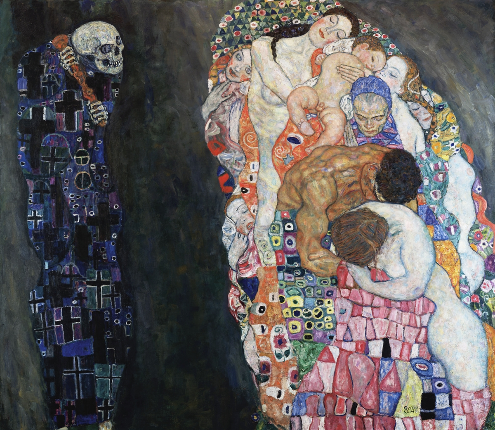

# Welcome to Biol 002 Lecture! {-}

**Instructor:** Dr. Lucy Delaney (`lucyd@ucr.edu`)  
**Time:** MWF 5:00pm-5:50pm  
**Classroom:** Bournes Hall B118  
**Office Hours:** TBD

{width="48%"}

For all of our differences, we have so much in common. We are all human beings. We are all made up of the same proteins, our genes constructed with the same DNA. We are all together on this rock hurtling through space, and we are all powered by energy from the same star. But where did this rock come from? Why are we hurtling around it? How did life originate? What does it mean to be "alive"? In this course, we will wrestle with these and other questions, exploring the answers we've uncovered and the ones that we still seek.

This is our informal course textbook, [online](https://ledelaney.org/teaching/2022/spring/biol002) or in [PDF](https://ledelaney.org/teaching/2022/spring/biol002/_main.pdf). You can access the materials for class on [the website](https://ledelaney.org/teaching/2022/spring/biol002), or through [Canvas](https://elearn.ucr.edu/). Unit material---including the reading and slides---will be available the week before we begin the unit. Check out the [syllabus](https://drive.google.com/file/d/1soUnmkct8myyRYeWrvKTqa6grq7ZS_jy/view?usp=sharing) for more details.

